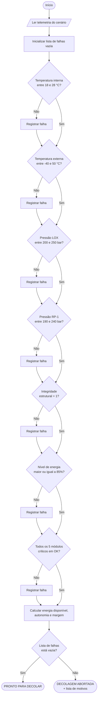

# Verificador de Telemetria Aurora-1 — Implementation Plan

> **For agentic workers:** REQUIRED SUB-SKILL: Use superpowers:subagent-driven-development (recommended) or superpowers:executing-plans to implement this plan task-by-task. Steps use checkbox (`- [ ]`) syntax for tracking.

**Goal:** Entregar, em `entrega-fase1/`, um verificador de telemetria pré-lançamento que decide entre "PRONTO PARA DECOLAR" e "DECOLAGEM ABORTADA", calcula a autonomia energética da missão e vem acompanhado de notebook, relatório em PDF e README — os cinco critérios de avaliação da Atividade Integradora FIAP Fase 1.

**Architecture:** Toda a lógica vive em um único módulo sem estado, `entrega-fase1/src/missao.py`, com funções puras e dois dataclasses de resultado. `tests/test_missao.py` testa esse módulo com pytest. O notebook `notebooks/analise_telemetria.ipynb` importa o módulo (não redefine a lógica) e é executado com outputs salvos. Documentação (fluxograma, pseudocódigo, relatório) fica em `docs/` e descreve exatamente o que o código faz.

**Tech Stack:** Python 3.14 (apenas stdlib no código entregue), pytest, nbformat + nbclient (geração/execução do notebook), Chrome headless `--print-to-pdf` (relatório em PDF), `gh` CLI (publicação).

**Spec:** `docs/superpowers/specs/2026-09-15-telemetria-aurora1-design.md`

## Global Constraints

- Todo texto voltado ao avaliador (código, comentários, docstrings, docs, notebook, README) em **português do Brasil**.
- O código entregue em `entrega-fase1/src/` usa **apenas a biblioteca padrão** do Python. pytest/nbformat/nbclient são ferramentas de desenvolvimento, não dependências de execução.
- Ambiente de desenvolvimento: virtualenv em `.venv/` na raiz do projeto. Nunca instalar pacotes no Python do sistema.
- Ferramentas auxiliares que **não** fazem parte da entrega (gerador de notebook, gerador de PDF) ficam em `tools/` na **raiz do projeto**, fora de `entrega-fase1/`.
- Faixas seguras, valores de telemetria e constantes energéticas são exatamente os do spec, seção 3 e 5. Não inventar outros números.
- Decisões: as strings são literalmente `"PRONTO PARA DECOLAR"` e `"DECOLAGEM ABORTADA"`.
- O verificador **nunca** para na primeira falha: avalia todos os parâmetros e retorna a lista completa de motivos.
- Commits em português, no formato `tipo: descrição`, terminando com:
  ```
  Co-Authored-By: Claude Opus 5 (1M context) <noreply@anthropic.com>
  ```
- Nada é publicado no GitHub sem autorização explícita do usuário (Task 9).

---

## File Structure

| Arquivo | Responsabilidade |
|---|---|
| `entrega-fase1/data/telemetria.json` | Leituras dos 3 cenários + metadados da missão. Dado, nunca lógica. |
| `entrega-fase1/src/missao.py` | Faixas seguras, carregamento, verificação, energia, formatação. Única fonte da lógica. |
| `entrega-fase1/tests/test_missao.py` | pytest sobre `missao.py`. |
| `entrega-fase1/notebooks/analise_telemetria.ipynb` | Entregável principal: narrativa + execução importando `missao.py`. |
| `entrega-fase1/docs/fluxograma.md` | Fluxograma Mermaid do algoritmo. |
| `entrega-fase1/docs/pseudocodigo.md` | Pseudocódigo em português estruturado. |
| `entrega-fase1/docs/relatorio.md` | Relatório completo (inclui análise por IA e reflexão crítica). |
| `entrega-fase1/docs/relatorio.pdf` | Conversão do anterior. |
| `entrega-fase1/README.md` | Explicação, instruções de execução, espaços para prints. |
| `entrega-fase1/requirements.txt` | Dependências de desenvolvimento. |
| `tools/gerar_notebook.py` | Gera e executa o `.ipynb`. Fora da entrega. |
| `tools/gerar_pdf.py` | Markdown → HTML → PDF via Chrome headless. Fora da entrega. |

---

### Task 1: Ambiente de desenvolvimento e dados de telemetria

**Files:**
- Create: `.gitignore`
- Create: `entrega-fase1/requirements.txt`
- Create: `entrega-fase1/data/telemetria.json`
- Create: `entrega-fase1/src/missao.py`
- Test: `entrega-fase1/tests/test_missao.py`

**Interfaces:**
- Consumes: nada (primeira task).
- Produces:
  - `FAIXAS: dict[str, tuple[float, float]]` — chave do parâmetro → (mínimo, máximo) inclusivos.
  - `ENERGIA_MINIMA_PCT: float = 85.0`
  - `MODULOS_CRITICOS: tuple[str, ...]`
  - `ROTULOS: dict[str, str]` — chave técnica → nome legível em português.
  - `carregar_telemetria(caminho: str | Path, cenario: str = "nominal") -> dict` — devolve o dicionário de leituras do cenário; levanta `KeyError` com mensagem em português se o cenário não existir.
  - `CAMINHO_PADRAO: Path` — caminho absoluto de `data/telemetria.json`, resolvido a partir de `__file__`, para o notebook não depender do diretório de trabalho.

- [ ] **Step 1: Criar o virtualenv e instalar as ferramentas**

```bash
cd /Users/gustavo.nakahodo/Nakahodo/projects/fiap
python3 -m venv .venv
.venv/bin/pip install --quiet --upgrade pip
.venv/bin/pip install --quiet pytest nbformat nbclient ipykernel markdown
.venv/bin/pytest --version
```
Expected: imprime a versão do pytest.

- [ ] **Step 2: Criar `.gitignore`**

```
.venv/
__pycache__/
*.pyc
.pytest_cache/
.DS_Store
.ipynb_checkpoints/
```

- [ ] **Step 3: Criar `entrega-fase1/requirements.txt`**

```
# O código de src/ usa apenas a biblioteca padrão do Python (>= 3.10).
# As dependências abaixo servem apenas para rodar os testes e o notebook.
pytest>=8.0
jupyter>=1.0
```

- [ ] **Step 4: Criar `entrega-fase1/data/telemetria.json`**

```json
{
  "missao": "Aurora-1",
  "veiculo": "Lançador de carga, propelentes LOX/RP-1",
  "janela": "T-10min",
  "cenarios": {
    "nominal": {
      "temperatura_interna_c": 23.4,
      "temperatura_externa_c": 12.8,
      "integridade_estrutural": 1,
      "nivel_energia_pct": 92.0,
      "pressao_lox_bar": 228.0,
      "pressao_rp1_bar": 214.0,
      "modulos_criticos": {
        "navegacao": "OK",
        "comunicacao": "OK",
        "propulsao": "OK",
        "controle_termico": "OK",
        "suporte_vida": "OK"
      }
    },
    "falha_termica": {
      "temperatura_interna_c": 31.2,
      "temperatura_externa_c": 12.8,
      "integridade_estrutural": 1,
      "nivel_energia_pct": 92.0,
      "pressao_lox_bar": 228.0,
      "pressao_rp1_bar": 214.0,
      "modulos_criticos": {
        "navegacao": "OK",
        "comunicacao": "OK",
        "propulsao": "OK",
        "controle_termico": "OK",
        "suporte_vida": "OK"
      }
    },
    "falha_multipla": {
      "temperatura_interna_c": 34.5,
      "temperatura_externa_c": 12.8,
      "integridade_estrutural": 0,
      "nivel_energia_pct": 78.0,
      "pressao_lox_bar": 188.0,
      "pressao_rp1_bar": 214.0,
      "modulos_criticos": {
        "navegacao": "OK",
        "comunicacao": "FALHA",
        "propulsao": "OK",
        "controle_termico": "FALHA",
        "suporte_vida": "OK"
      }
    }
  }
}
```

- [ ] **Step 5: Escrever os testes que falham**

```python
"""Testes do módulo de verificação da missão Aurora-1."""
import sys
from pathlib import Path

import pytest

sys.path.insert(0, str(Path(__file__).resolve().parents[1] / "src"))

import missao


def test_carrega_cenario_nominal():
    dados = missao.carregar_telemetria(missao.CAMINHO_PADRAO, "nominal")
    assert dados["temperatura_interna_c"] == 23.4
    assert dados["integridade_estrutural"] == 1
    assert dados["modulos_criticos"]["propulsao"] == "OK"


def test_carrega_cenario_de_falha():
    dados = missao.carregar_telemetria(missao.CAMINHO_PADRAO, "falha_multipla")
    assert dados["nivel_energia_pct"] == 78.0
    assert dados["modulos_criticos"]["comunicacao"] == "FALHA"


def test_cenario_inexistente_levanta_erro_em_portugues():
    with pytest.raises(KeyError, match="inexistente"):
        missao.carregar_telemetria(missao.CAMINHO_PADRAO, "inexistente")


def test_faixas_seguras_conferem_com_o_spec():
    assert missao.FAIXAS["temperatura_interna_c"] == (18.0, 28.0)
    assert missao.FAIXAS["temperatura_externa_c"] == (-40.0, 50.0)
    assert missao.FAIXAS["pressao_lox_bar"] == (200.0, 250.0)
    assert missao.FAIXAS["pressao_rp1_bar"] == (190.0, 240.0)
    assert missao.ENERGIA_MINIMA_PCT == 85.0
    assert len(missao.MODULOS_CRITICOS) == 5
```

- [ ] **Step 6: Rodar os testes e confirmar que falham**

Run: `.venv/bin/pytest entrega-fase1/tests/test_missao.py -v`
Expected: FAIL com `ModuleNotFoundError: No module named 'missao'`.

- [ ] **Step 7: Implementar o mínimo em `entrega-fase1/src/missao.py`**

```python
"""Verificação de telemetria pré-lançamento da missão Aurora-1.

Módulo sem estado: todas as funções são puras e recebem os dados de que
precisam. Usa apenas a biblioteca padrão do Python.
"""

from __future__ import annotations

import json
from pathlib import Path

CAMINHO_PADRAO = Path(__file__).resolve().parents[1] / "data" / "telemetria.json"

# Faixas seguras (mínimo e máximo inclusivos) definidas como premissa do projeto.
FAIXAS: dict[str, tuple[float, float]] = {
    "temperatura_interna_c": (18.0, 28.0),
    "temperatura_externa_c": (-40.0, 50.0),
    "pressao_lox_bar": (200.0, 250.0),
    "pressao_rp1_bar": (190.0, 240.0),
}

ENERGIA_MINIMA_PCT = 85.0

MODULOS_CRITICOS: tuple[str, ...] = (
    "navegacao",
    "comunicacao",
    "propulsao",
    "controle_termico",
    "suporte_vida",
)

ROTULOS: dict[str, str] = {
    "temperatura_interna_c": "Temperatura interna",
    "temperatura_externa_c": "Temperatura externa",
    "integridade_estrutural": "Integridade estrutural",
    "nivel_energia_pct": "Nível de energia",
    "pressao_lox_bar": "Pressão do tanque de LOX",
    "pressao_rp1_bar": "Pressão do tanque de RP-1",
    "modulos_criticos": "Módulos críticos",
    "navegacao": "navegação",
    "comunicacao": "comunicação",
    "propulsao": "propulsão",
    "controle_termico": "controle térmico",
    "suporte_vida": "suporte de vida",
}

UNIDADES: dict[str, str] = {
    "temperatura_interna_c": "°C",
    "temperatura_externa_c": "°C",
    "nivel_energia_pct": "%",
    "pressao_lox_bar": "bar",
    "pressao_rp1_bar": "bar",
}


def carregar_telemetria(caminho: str | Path = CAMINHO_PADRAO,
                        cenario: str = "nominal") -> dict:
    """Lê o arquivo de telemetria e devolve as leituras de um cenário."""
    with open(caminho, encoding="utf-8") as arquivo:
        conteudo = json.load(arquivo)
    cenarios = conteudo["cenarios"]
    if cenario not in cenarios:
        disponiveis = ", ".join(sorted(cenarios))
        raise KeyError(
            f"Cenário '{cenario}' inexistente. Disponíveis: {disponiveis}."
        )
    return cenarios[cenario]
```

- [ ] **Step 8: Rodar os testes e confirmar que passam**

Run: `.venv/bin/pytest entrega-fase1/tests/test_missao.py -v`
Expected: 4 passed.

- [ ] **Step 9: Commit**

```bash
git add .gitignore entrega-fase1/requirements.txt entrega-fase1/data/telemetria.json entrega-fase1/src/missao.py entrega-fase1/tests/test_missao.py
git commit -m "feat: telemetria da missão Aurora-1 e carregamento dos cenários

Co-Authored-By: Claude Opus 5 (1M context) <noreply@anthropic.com>"
```

---

### Task 2: Algoritmo de verificação e decisão de lançamento

**Files:**
- Modify: `entrega-fase1/src/missao.py` (acrescentar ao final)
- Test: `entrega-fase1/tests/test_missao.py` (acrescentar ao final)

**Interfaces:**
- Consumes: de Task 1 — `FAIXAS`, `ENERGIA_MINIMA_PCT`, `MODULOS_CRITICOS`, `ROTULOS`, `UNIDADES`, `carregar_telemetria`.
- Produces:
  - `DECISAO_APROVADA: str = "PRONTO PARA DECOLAR"`
  - `DECISAO_ABORTADA: str = "DECOLAGEM ABORTADA"`
  - `ResultadoVerificacao` — dataclass congelado com `aprovado: bool`, `decisao: str`, `falhas: tuple[str, ...]`.
  - `verificar_telemetria(dados: dict) -> ResultadoVerificacao` — avalia **todos** os parâmetros e devolve a lista completa de falhas.

- [ ] **Step 1: Escrever os testes que falham**

Acrescentar ao final de `entrega-fase1/tests/test_missao.py`:

```python
def _telemetria(**alteracoes):
    """Telemetria nominal com os campos indicados sobrescritos."""
    dados = missao.carregar_telemetria(missao.CAMINHO_PADRAO, "nominal")
    modulos = alteracoes.pop("modulos_criticos", None)
    dados.update(alteracoes)
    if modulos:
        dados["modulos_criticos"] = {**dados["modulos_criticos"], **modulos}
    return dados


def test_cenario_nominal_libera_o_lancamento():
    resultado = missao.verificar_telemetria(_telemetria())
    assert resultado.aprovado is True
    assert resultado.decisao == "PRONTO PARA DECOLAR"
    assert resultado.falhas == ()


@pytest.mark.parametrize("valor", [18.0, 28.0])
def test_limites_da_faixa_sao_inclusivos(valor):
    resultado = missao.verificar_telemetria(_telemetria(temperatura_interna_c=valor))
    assert resultado.aprovado is True


@pytest.mark.parametrize("valor", [17.9, 28.1])
def test_temperatura_interna_fora_da_faixa_aborta(valor):
    resultado = missao.verificar_telemetria(_telemetria(temperatura_interna_c=valor))
    assert resultado.aprovado is False
    assert resultado.decisao == "DECOLAGEM ABORTADA"
    assert any("Temperatura interna" in f for f in resultado.falhas)


@pytest.mark.parametrize("chave,valor", [
    ("temperatura_externa_c", 50.1),
    ("temperatura_externa_c", -40.1),
    ("pressao_lox_bar", 199.9),
    ("pressao_lox_bar", 250.1),
    ("pressao_rp1_bar", 189.9),
    ("pressao_rp1_bar", 240.1),
])
def test_cada_parametro_numerico_fora_da_faixa_aborta(chave, valor):
    resultado = missao.verificar_telemetria(_telemetria(**{chave: valor}))
    assert resultado.aprovado is False
    assert any(missao.ROTULOS[chave] in f for f in resultado.falhas)


def test_integridade_estrutural_comprometida_aborta():
    resultado = missao.verificar_telemetria(_telemetria(integridade_estrutural=0))
    assert resultado.aprovado is False
    assert any("Integridade estrutural" in f for f in resultado.falhas)


@pytest.mark.parametrize("valor,aprovado", [(85.0, True), (84.9, False)])
def test_nivel_minimo_de_energia(valor, aprovado):
    resultado = missao.verificar_telemetria(_telemetria(nivel_energia_pct=valor))
    assert resultado.aprovado is aprovado


def test_modulo_critico_em_falha_aborta():
    resultado = missao.verificar_telemetria(
        _telemetria(modulos_criticos={"propulsao": "FALHA"})
    )
    assert resultado.aprovado is False
    assert any("propulsão" in f for f in resultado.falhas)


def test_todas_as_falhas_sao_reportadas_e_nao_apenas_a_primeira():
    dados = missao.carregar_telemetria(missao.CAMINHO_PADRAO, "falha_multipla")
    resultado = missao.verificar_telemetria(dados)
    assert resultado.aprovado is False
    assert len(resultado.falhas) == 5
    esperados = ["Temperatura interna", "Integridade estrutural",
                 "Nível de energia", "Pressão do tanque de LOX",
                 "comunicação", "controle térmico"]
    texto = " | ".join(resultado.falhas)
    for esperado in esperados:
        assert esperado in texto
```

- [ ] **Step 2: Rodar os testes e confirmar que falham**

Run: `.venv/bin/pytest entrega-fase1/tests/test_missao.py -v`
Expected: FAIL com `AttributeError: module 'missao' has no attribute 'verificar_telemetria'`.

- [ ] **Step 3: Implementar**

Acrescentar ao topo de `entrega-fase1/src/missao.py` o import `from dataclasses import dataclass` e, ao final, o seguinte:

```python
DECISAO_APROVADA = "PRONTO PARA DECOLAR"
DECISAO_ABORTADA = "DECOLAGEM ABORTADA"


@dataclass(frozen=True)
class ResultadoVerificacao:
    """Veredito do checklist pré-lançamento."""

    aprovado: bool
    decisao: str
    falhas: tuple[str, ...]


def verificar_telemetria(dados: dict) -> ResultadoVerificacao:
    """Aplica todas as verificações de segurança e decide sobre o lançamento.

    Avalia todos os parâmetros antes de decidir: um relatório de aborto que
    parasse na primeira falha esconderia problemas do operador.
    """
    falhas: list[str] = []

    for chave, (mínimo, máximo) in FAIXAS.items():
        valor = dados[chave]
        if not mínimo <= valor <= máximo:
            unidade = UNIDADES[chave]
            falhas.append(
                f"{ROTULOS[chave]}: {valor} {unidade} fora da faixa segura "
                f"({mínimo} a {máximo} {unidade})."
            )

    if dados["integridade_estrutural"] != 1:
        falhas.append(
            f"{ROTULOS['integridade_estrutural']}: comprometida "
            f"(leitura {dados['integridade_estrutural']}, esperado 1)."
        )

    energia = dados["nivel_energia_pct"]
    if energia < ENERGIA_MINIMA_PCT:
        falhas.append(
            f"{ROTULOS['nivel_energia_pct']}: {energia} % abaixo do mínimo de "
            f"{ENERGIA_MINIMA_PCT} %."
        )

    modulos = dados["modulos_criticos"]
    em_falha = [ROTULOS[nome] for nome in MODULOS_CRITICOS
                if modulos.get(nome) != "OK"]
    if em_falha:
        falhas.append(
            f"{ROTULOS['modulos_criticos']} em falha: {', '.join(em_falha)}."
        )

    aprovado = not falhas
    return ResultadoVerificacao(
        aprovado=aprovado,
        decisao=DECISAO_APROVADA if aprovado else DECISAO_ABORTADA,
        falhas=tuple(falhas),
    )
```

- [ ] **Step 4: Rodar os testes e confirmar que passam**

Run: `.venv/bin/pytest entrega-fase1/tests/test_missao.py -v`
Expected: todos passam. Se `test_todas_as_falhas_sao_reportadas_e_nao_apenas_a_primeira` falhar na contagem, conferir: o cenário `falha_multipla` produz 5 falhas (temperatura interna, LOX, integridade, energia, módulos) — os dois módulos em falha entram em **uma** única entrada.

- [ ] **Step 5: Commit**

```bash
git add entrega-fase1/src/missao.py entrega-fase1/tests/test_missao.py
git commit -m "feat: algoritmo de verificação e decisão de lançamento

Co-Authored-By: Claude Opus 5 (1M context) <noreply@anthropic.com>"
```

---

### Task 3: Análise energética

**Files:**
- Modify: `entrega-fase1/src/missao.py` (acrescentar ao final)
- Test: `entrega-fase1/tests/test_missao.py` (acrescentar ao final)

**Interfaces:**
- Consumes: de Task 1 e 2 — nada além do próprio módulo.
- Produces:
  - `CAPACIDADE_TOTAL_KWH = 120.0`, `PERDAS_PCT = 8.0`, `CONSUMO_DECOLAGEM_KWH = 45.0`, `CONSUMO_VOO_KW = 6.5`, `MARGEM_MINIMA_PCT = 20.0`
  - `ResultadoEnergia` — dataclass congelado com `disponivel_kwh`, `restante_kwh`, `autonomia_h`, `margem_pct` (todos `float`) e `aprovado: bool`.
  - `analisar_energia(carga_pct: float, capacidade_kwh: float = CAPACIDADE_TOTAL_KWH, perdas_pct: float = PERDAS_PCT, consumo_decolagem_kwh: float = CONSUMO_DECOLAGEM_KWH, consumo_voo_kw: float = CONSUMO_VOO_KW) -> ResultadoEnergia`

- [ ] **Step 1: Escrever os testes que falham**

Acrescentar ao final de `entrega-fase1/tests/test_missao.py`:

```python
def test_analise_energetica_do_cenario_nominal():
    resultado = missao.analisar_energia(carga_pct=92.0)
    assert resultado.disponivel_kwh == pytest.approx(101.568, abs=1e-3)
    assert resultado.restante_kwh == pytest.approx(56.568, abs=1e-3)
    assert resultado.autonomia_h == pytest.approx(8.7028, abs=1e-3)
    assert resultado.margem_pct == pytest.approx(125.707, abs=1e-3)
    assert resultado.aprovado is True


def test_analise_energetica_sem_perdas_e_numeros_redondos():
    resultado = missao.analisar_energia(
        carga_pct=50.0, capacidade_kwh=100.0, perdas_pct=0.0,
        consumo_decolagem_kwh=25.0, consumo_voo_kw=5.0,
    )
    assert resultado.disponivel_kwh == pytest.approx(50.0)
    assert resultado.restante_kwh == pytest.approx(25.0)
    assert resultado.autonomia_h == pytest.approx(5.0)
    assert resultado.margem_pct == pytest.approx(100.0)
    assert resultado.aprovado is True


def test_margem_abaixo_do_minimo_reprova():
    # 100 kWh x 30% = 30 disponíveis, consumo 27 -> margem 11,1 % (< 20 %)
    resultado = missao.analisar_energia(
        carga_pct=30.0, capacidade_kwh=100.0, perdas_pct=0.0,
        consumo_decolagem_kwh=27.0, consumo_voo_kw=5.0,
    )
    assert resultado.margem_pct == pytest.approx(11.111, abs=1e-3)
    assert resultado.aprovado is False


def test_energia_insuficiente_para_decolar_zera_autonomia():
    resultado = missao.analisar_energia(
        carga_pct=10.0, capacidade_kwh=100.0, perdas_pct=0.0,
        consumo_decolagem_kwh=45.0, consumo_voo_kw=5.0,
    )
    assert resultado.restante_kwh == pytest.approx(-35.0)
    assert resultado.autonomia_h == 0.0
    assert resultado.aprovado is False
```

- [ ] **Step 2: Rodar os testes e confirmar que falham**

Run: `.venv/bin/pytest entrega-fase1/tests/test_missao.py -k energ -v`
Expected: FAIL com `AttributeError: module 'missao' has no attribute 'analisar_energia'`.

- [ ] **Step 3: Implementar**

Acrescentar ao final de `entrega-fase1/src/missao.py`:

```python
# Parâmetros energéticos do veículo (premissas do projeto).
CAPACIDADE_TOTAL_KWH = 120.0
PERDAS_PCT = 8.0
CONSUMO_DECOLAGEM_KWH = 45.0
CONSUMO_VOO_KW = 6.5
MARGEM_MINIMA_PCT = 20.0


@dataclass(frozen=True)
class ResultadoEnergia:
    """Balanço energético da missão."""

    disponivel_kwh: float
    restante_kwh: float
    autonomia_h: float
    margem_pct: float
    aprovado: bool


def analisar_energia(
    carga_pct: float,
    capacidade_kwh: float = CAPACIDADE_TOTAL_KWH,
    perdas_pct: float = PERDAS_PCT,
    consumo_decolagem_kwh: float = CONSUMO_DECOLAGEM_KWH,
    consumo_voo_kw: float = CONSUMO_VOO_KW,
) -> ResultadoEnergia:
    """Calcula energia disponível, autonomia de voo e margem de segurança.

    A autonomia é o tempo de voo sustentável com a energia que sobra depois
    da decolagem. Se não sobra energia, a autonomia é zero — nunca negativa.
    """
    disponivel = capacidade_kwh * (carga_pct / 100.0) * (1 - perdas_pct / 100.0)
    restante = disponivel - consumo_decolagem_kwh
    autonomia = restante / consumo_voo_kw if restante > 0 else 0.0
    margem = (restante / consumo_decolagem_kwh) * 100.0
    return ResultadoEnergia(
        disponivel_kwh=disponivel,
        restante_kwh=restante,
        autonomia_h=autonomia,
        margem_pct=margem,
        aprovado=margem >= MARGEM_MINIMA_PCT,
    )
```

- [ ] **Step 4: Rodar a suíte inteira e confirmar que passa**

Run: `.venv/bin/pytest entrega-fase1/tests/ -v`
Expected: todos passam.

- [ ] **Step 5: Commit**

```bash
git add entrega-fase1/src/missao.py entrega-fase1/tests/test_missao.py
git commit -m "feat: análise energética com autonomia e margem de segurança

Co-Authored-By: Claude Opus 5 (1M context) <noreply@anthropic.com>"
```

---

### Task 4: Relatório em texto e execução por linha de comando

**Files:**
- Modify: `entrega-fase1/src/missao.py` (acrescentar ao final)
- Test: `entrega-fase1/tests/test_missao.py` (acrescentar ao final)

**Interfaces:**
- Consumes: de Tasks 1–3 — `carregar_telemetria`, `verificar_telemetria`, `analisar_energia`, `ResultadoVerificacao`, `ResultadoEnergia`, `ROTULOS`, `UNIDADES`, `FAIXAS`.
- Produces:
  - `formatar_relatorio(dados: dict, verificacao: ResultadoVerificacao, energia: ResultadoEnergia, cenario: str) -> str` — relatório legível em texto puro, com tabela de telemetria, decisão, motivos e balanço energético.
  - `executar(cenario: str = "nominal", caminho: str | Path = CAMINHO_PADRAO) -> str` — orquestra carregar → verificar → analisar → formatar e devolve o relatório.
  - Bloco `if __name__ == "__main__":` aceitando o cenário como primeiro argumento de linha de comando.

- [ ] **Step 1: Escrever os testes que falham**

Acrescentar ao final de `entrega-fase1/tests/test_missao.py`:

```python
def test_relatorio_nominal_mostra_decisao_e_autonomia():
    texto = missao.executar("nominal")
    assert "PRONTO PARA DECOLAR" in texto
    assert "Aurora-1" in texto
    assert "8.70 h" in texto
    assert "Nenhuma" in texto


def test_relatorio_de_falha_lista_todos_os_motivos():
    texto = missao.executar("falha_multipla")
    assert "DECOLAGEM ABORTADA" in texto
    assert "Temperatura interna" in texto
    assert "comunicação" in texto
    assert texto.count("- ") >= 5


def test_relatorio_mostra_cada_parametro_com_sua_faixa():
    texto = missao.executar("nominal")
    assert "23.4" in texto
    assert "18.0 a 28.0" in texto
    assert "OK" in texto


def test_execucao_por_linha_de_comando():
    import subprocess
    import sys as _sys
    caminho = Path(missao.__file__)
    saida = subprocess.run(
        [_sys.executable, str(caminho), "falha_termica"],
        capture_output=True, text=True, check=True,
    )
    assert "DECOLAGEM ABORTADA" in saida.stdout
```

- [ ] **Step 2: Rodar os testes e confirmar que falham**

Run: `.venv/bin/pytest entrega-fase1/tests/test_missao.py -k "relatorio or linha_de_comando" -v`
Expected: FAIL com `AttributeError: module 'missao' has no attribute 'executar'`.

- [ ] **Step 3: Implementar**

Acrescentar ao final de `entrega-fase1/src/missao.py`:

```python
def _linha_parametro(chave: str, valor, faixa: str, situacao: str) -> str:
    return f"  {ROTULOS[chave]:<28} {str(valor):>10}  {faixa:<20} {situacao}"


def formatar_relatorio(dados: dict, verificacao: ResultadoVerificacao,
                       energia: ResultadoEnergia, cenario: str) -> str:
    """Monta o relatório de pré-lançamento em texto puro."""
    linhas: list[str] = []
    linhas.append("=" * 78)
    linhas.append("RELATÓRIO DE PRÉ-LANÇAMENTO — MISSÃO AURORA-1")
    linhas.append(f"Cenário de telemetria: {cenario}")
    linhas.append("=" * 78)
    linhas.append("")
    linhas.append("1. TELEMETRIA")
    linhas.append(
        f"  {'Parâmetro':<28} {'Leitura':>10}  {'Faixa segura':<20} Situação"
    )
    linhas.append("  " + "-" * 74)

    for chave, (mínimo, máximo) in FAIXAS.items():
        valor = dados[chave]
        unidade = UNIDADES[chave]
        dentro = mínimo <= valor <= máximo
        linhas.append(_linha_parametro(
            chave, f"{valor} {unidade}", f"{mínimo} a {máximo} {unidade}",
            "OK" if dentro else "FORA DA FAIXA",
        ))

    integridade = dados["integridade_estrutural"]
    linhas.append(_linha_parametro(
        "integridade_estrutural", integridade, "= 1",
        "OK" if integridade == 1 else "COMPROMETIDA",
    ))

    energia_pct = dados["nivel_energia_pct"]
    linhas.append(_linha_parametro(
        "nivel_energia_pct", f"{energia_pct} %", f">= {ENERGIA_MINIMA_PCT} %",
        "OK" if energia_pct >= ENERGIA_MINIMA_PCT else "INSUFICIENTE",
    ))

    linhas.append("")
    linhas.append("  Módulos críticos:")
    for nome in MODULOS_CRITICOS:
        estado = dados["modulos_criticos"].get(nome, "DESCONHECIDO")
        linhas.append(f"    - {ROTULOS[nome]:<22} {estado}")

    linhas.append("")
    linhas.append("2. ANÁLISE ENERGÉTICA")
    linhas.append(f"  Capacidade total .................. {CAPACIDADE_TOTAL_KWH:.2f} kWh")
    linhas.append(f"  Carga atual ....................... {energia_pct:.2f} %")
    linhas.append(f"  Perdas energéticas ................ {PERDAS_PCT:.2f} %")
    linhas.append(f"  Energia disponível ................ {energia.disponivel_kwh:.2f} kWh")
    linhas.append(f"  Consumo na decolagem .............. {CONSUMO_DECOLAGEM_KWH:.2f} kWh")
    linhas.append(f"  Energia restante .................. {energia.restante_kwh:.2f} kWh")
    linhas.append(f"  Consumo em voo .................... {CONSUMO_VOO_KW:.2f} kW")
    linhas.append(f"  Autonomia estimada ................ {energia.autonomia_h:.2f} h")
    linhas.append(
        f"  Margem sobre a decolagem .......... {energia.margem_pct:.2f} % "
        f"(mínimo {MARGEM_MINIMA_PCT:.0f} %) — "
        f"{'ADEQUADA' if energia.aprovado else 'INSUFICIENTE'}"
    )

    linhas.append("")
    linhas.append("3. MOTIVOS DE ABORTO")
    if verificacao.falhas:
        linhas.extend(f"  - {falha}" for falha in verificacao.falhas)
    else:
        linhas.append("  Nenhuma inconformidade encontrada.")

    linhas.append("")
    linhas.append("=" * 78)
    linhas.append(f"DECISÃO: {verificacao.decisao}")
    linhas.append("=" * 78)
    return "\n".join(linhas)


def executar(cenario: str = "nominal",
             caminho: str | Path = CAMINHO_PADRAO) -> str:
    """Executa o fluxo completo e devolve o relatório de pré-lançamento."""
    dados = carregar_telemetria(caminho, cenario)
    verificacao = verificar_telemetria(dados)
    energia = analisar_energia(dados["nivel_energia_pct"])
    return formatar_relatorio(dados, verificacao, energia, cenario)


if __name__ == "__main__":
    import sys

    cenario_escolhido = sys.argv[1] if len(sys.argv) > 1 else "nominal"
    print(executar(cenario_escolhido))
```

- [ ] **Step 4: Rodar a suíte inteira e confirmar que passa**

Run: `.venv/bin/pytest entrega-fase1/tests/ -v`
Expected: todos passam.

- [ ] **Step 5: Conferir a saída a olho nu nos três cenários**

Run:
```bash
for c in nominal falha_termica falha_multipla; do .venv/bin/python entrega-fase1/src/missao.py $c; done
```
Expected: três relatórios alinhados, o primeiro com PRONTO PARA DECOLAR e os outros dois com DECOLAGEM ABORTADA e os motivos corretos.

- [ ] **Step 6: Commit**

```bash
git add entrega-fase1/src/missao.py entrega-fase1/tests/test_missao.py
git commit -m "feat: relatório de pré-lançamento e execução por linha de comando

Co-Authored-By: Claude Opus 5 (1M context) <noreply@anthropic.com>"
```

---

### Task 5: Fluxograma e pseudocódigo

**Files:**
- Create: `entrega-fase1/docs/fluxograma.md`
- Create: `entrega-fase1/docs/pseudocodigo.md`

**Interfaces:**
- Consumes: de Tasks 2 e 3 — a lógica implementada em `verificar_telemetria` e `analisar_energia`.
- Produces: nada consumido por código. Documentos citados pelo README (Task 8) e pelo relatório (Task 7).

- [ ] **Step 1: Escrever `entrega-fase1/docs/fluxograma.md`**

````markdown
# Fluxograma do algoritmo de verificação

O diagrama abaixo está em Mermaid e é renderizado automaticamente pelo GitHub.



**Ponto central do desenho:** nenhuma resposta "Não" salta para o fim. Cada
verificação registra sua falha e segue para a próxima, de modo que o operador
receba a lista completa de problemas em uma única passagem — e não descubra um
problema por vez a cada tentativa de lançamento.
````

- [ ] **Step 2: Escrever `entrega-fase1/docs/pseudocodigo.md`**

````markdown
# Pseudocódigo do algoritmo de verificação

```
ALGORITMO VerificacaoPreLancamento

CONSTANTES
    TEMP_INTERNA_MIN   <- 18.0     TEMP_INTERNA_MAX   <- 28.0     // °C
    TEMP_EXTERNA_MIN   <- -40.0    TEMP_EXTERNA_MAX   <- 50.0     // °C
    PRESSAO_LOX_MIN    <- 200.0    PRESSAO_LOX_MAX    <- 250.0    // bar
    PRESSAO_RP1_MIN    <- 190.0    PRESSAO_RP1_MAX    <- 240.0    // bar
    ENERGIA_MINIMA     <- 85.0                                    // %
    MODULOS_CRITICOS   <- [navegação, comunicação, propulsão,
                           controle térmico, suporte de vida]
    CAPACIDADE_TOTAL   <- 120.0    // kWh
    PERDAS             <- 8.0      // %
    CONSUMO_DECOLAGEM  <- 45.0     // kWh
    CONSUMO_VOO        <- 6.5      // kW
    MARGEM_MINIMA      <- 20.0     // %

INÍCIO
    LER telemetria DO cenário escolhido
    falhas <- lista vazia

    // 1. Parâmetros com faixa de mínimo e máximo (limites inclusivos)
    SE NÃO (TEMP_INTERNA_MIN <= telemetria.temperatura_interna <= TEMP_INTERNA_MAX) ENTÃO
        ADICIONAR "Temperatura interna fora da faixa segura" EM falhas
    FIM SE
    SE NÃO (TEMP_EXTERNA_MIN <= telemetria.temperatura_externa <= TEMP_EXTERNA_MAX) ENTÃO
        ADICIONAR "Temperatura externa fora da faixa segura" EM falhas
    FIM SE
    SE NÃO (PRESSAO_LOX_MIN <= telemetria.pressao_lox <= PRESSAO_LOX_MAX) ENTÃO
        ADICIONAR "Pressão do tanque de LOX fora da faixa segura" EM falhas
    FIM SE
    SE NÃO (PRESSAO_RP1_MIN <= telemetria.pressao_rp1 <= PRESSAO_RP1_MAX) ENTÃO
        ADICIONAR "Pressão do tanque de RP-1 fora da faixa segura" EM falhas
    FIM SE

    // 2. Parâmetro binário
    SE telemetria.integridade_estrutural <> 1 ENTÃO
        ADICIONAR "Integridade estrutural comprometida" EM falhas
    FIM SE

    // 3. Parâmetro com mínimo apenas
    SE telemetria.nivel_energia < ENERGIA_MINIMA ENTÃO
        ADICIONAR "Nível de energia abaixo do mínimo" EM falhas
    FIM SE

    // 4. Estado dos módulos críticos
    modulos_em_falha <- lista vazia
    PARA CADA modulo EM MODULOS_CRITICOS FAÇA
        SE telemetria.modulos_criticos[modulo] <> "OK" ENTÃO
            ADICIONAR modulo EM modulos_em_falha
        FIM SE
    FIM PARA
    SE modulos_em_falha NÃO ESTÁ VAZIA ENTÃO
        ADICIONAR "Módulos críticos em falha: " + modulos_em_falha EM falhas
    FIM SE

    // 5. Balanço energético (informativo, não bloqueia a decisão)
    disponivel <- CAPACIDADE_TOTAL * (telemetria.nivel_energia / 100)
                                   * (1 - PERDAS / 100)
    restante   <- disponivel - CONSUMO_DECOLAGEM
    SE restante > 0 ENTÃO
        autonomia <- restante / CONSUMO_VOO
    SENÃO
        autonomia <- 0
    FIM SE
    margem <- (restante / CONSUMO_DECOLAGEM) * 100

    // 6. Decisão
    SE falhas ESTÁ VAZIA ENTÃO
        decisao <- "PRONTO PARA DECOLAR"
    SENÃO
        decisao <- "DECOLAGEM ABORTADA"
    FIM SE

    ESCREVER telemetria, disponivel, restante, autonomia, margem
    ESCREVER decisao
    SE falhas NÃO ESTÁ VAZIA ENTÃO
        ESCREVER cada item de falhas
    FIM SE
FIM
```

## Decisões de projeto registradas no algoritmo

1. **Os limites são inclusivos.** Uma leitura de exatamente 28,0 °C é
   aprovada. A faixa segura é o intervalo fechado, não o aberto.
2. **A avaliação não interrompe na primeira falha.** Todas as verificações
   rodam sempre, e a saída traz a lista completa de motivos.
3. **A análise energética não bloqueia o lançamento.** Ela produz um parecer
   próprio (margem adequada ou insuficiente). O nível de carga em si já é
   verificado no item 3; a margem serve para o planejamento da missão depois
   da decolagem.
````

- [ ] **Step 3: Conferir que o fluxograma e o pseudocódigo batem com o código**

Abrir `entrega-fase1/src/missao.py` lado a lado e confirmar, item a item: os
quatro parâmetros com faixa, a integridade, o mínimo de energia, os cinco
módulos, e as fórmulas energéticas. Qualquer divergência é erro da
documentação — o código é a referência.

- [ ] **Step 4: Commit**

```bash
git add entrega-fase1/docs/fluxograma.md entrega-fase1/docs/pseudocodigo.md
git commit -m "docs: fluxograma e pseudocódigo do algoritmo de verificação

Co-Authored-By: Claude Opus 5 (1M context) <noreply@anthropic.com>"
```

---

### Task 6: Notebook Jupyter

**Files:**
- Create: `tools/gerar_notebook.py`
- Create: `entrega-fase1/notebooks/analise_telemetria.ipynb` (gerado e executado pelo script)

**Interfaces:**
- Consumes: de Tasks 1–4 — `missao.carregar_telemetria`, `missao.verificar_telemetria`, `missao.analisar_energia`, `missao.executar`, `missao.FAIXAS`, `missao.CAMINHO_PADRAO`.
- Produces: o `.ipynb` com outputs salvos, citado pelo README (Task 8).

- [ ] **Step 1: Escrever `tools/gerar_notebook.py`**

O notebook é gerado por script para que o conteúdo fique versionado como
Python legível e o `.ipynb` possa ser reconstruído a qualquer momento.

```python
"""Gera e executa o notebook de entrega a partir de células declaradas aqui.

Não faz parte da entrega: é ferramenta de build. Rodar da raiz do projeto:
    .venv/bin/python tools/gerar_notebook.py
"""

from pathlib import Path

import nbformat
from nbclient import NotebookClient

RAIZ = Path(__file__).resolve().parents[1]
DESTINO = RAIZ / "entrega-fase1" / "notebooks" / "analise_telemetria.ipynb"

MD = "markdown"
CODE = "code"

CELULAS: list[tuple[str, str]] = [
    (MD, """# Missão Aurora-1 — Verificação de Telemetria Pré-Lançamento

**Atividade Integradora — FIAP, Fase 1**

Este notebook executa o checklist de pré-lançamento do foguete Aurora-1: lê a
telemetria da janela T-10 min, aplica as faixas seguras de cada parâmetro,
decide entre `PRONTO PARA DECOLAR` e `DECOLAGEM ABORTADA`, e calcula a
autonomia energética da missão.

A lógica não é redefinida aqui: ela vive em `src/missao.py` e é coberta por
testes automatizados em `tests/test_missao.py`. O notebook importa esse módulo,
de modo que o que você executa abaixo é exatamente o código testado."""),

    (MD, """## 0. Preparação do ambiente

Se estiver no Google Colab, descomente e rode a célula de clone. Localmente,
basta executar a célula seguinte a partir do repositório."""),

    (CODE, """# No Google Colab, descomente as duas linhas abaixo:
# !git clone https://github.com/SEU_USUARIO/SEU_REPOSITORIO.git
# %cd SEU_REPOSITORIO/entrega-fase1/notebooks"""),

    (CODE, """import sys
from pathlib import Path

# Torna src/ importável a partir da pasta do notebook.
RAIZ = Path.cwd().parent if Path.cwd().name == "notebooks" else Path.cwd()
sys.path.insert(0, str(RAIZ / "src"))

import missao

print("Módulo carregado de:", missao.__file__)
print("Telemetria em:", missao.CAMINHO_PADRAO)"""),

    (MD, """## 1. Organização e descrição da telemetria

Os dados chegam em `data/telemetria.json` com três cenários: o nominal e dois
de falha, usados para demonstrar o comportamento do algoritmo. Cada parâmetro
tem uma faixa segura definida como premissa do projeto."""),

    (CODE, """dados = missao.carregar_telemetria(missao.CAMINHO_PADRAO, "nominal")

print(f"{'Parâmetro':<28} {'Leitura':>12}  {'Faixa segura':<22} Situação")
print("-" * 78)
for chave, (minimo, maximo) in missao.FAIXAS.items():
    valor = dados[chave]
    unidade = missao.UNIDADES[chave]
    situacao = "OK" if minimo <= valor <= maximo else "FORA DA FAIXA"
    print(f"{missao.ROTULOS[chave]:<28} {f'{valor} {unidade}':>12}  "
          f"{f'{minimo} a {maximo} {unidade}':<22} {situacao}")

print()
print(f"{'Integridade estrutural':<28} {dados['integridade_estrutural']:>12}  "
      f"{'= 1':<22} {'OK' if dados['integridade_estrutural'] == 1 else 'COMPROMETIDA'}")
print(f"{'Nível de energia':<28} {f\\"{dados['nivel_energia_pct']} %\\":>12}  "
      f"{'>= 85.0 %':<22} "
      f"{'OK' if dados['nivel_energia_pct'] >= missao.ENERGIA_MINIMA_PCT else 'INSUFICIENTE'}")

print()
print("Módulos críticos:")
for nome in missao.MODULOS_CRITICOS:
    print(f"  - {missao.ROTULOS[nome]:<22} {dados['modulos_criticos'][nome]}")"""),

    (MD, """## 2. Algoritmo de verificação

O fluxograma está em [`docs/fluxograma.md`](../docs/fluxograma.md) e o
pseudocódigo em [`docs/pseudocodigo.md`](../docs/pseudocodigo.md).

Duas decisões governam o algoritmo:

1. **Limites inclusivos.** Uma leitura de exatamente 28,0 °C é aprovada.
2. **Nenhuma parada antecipada.** Todas as verificações são executadas mesmo
   depois da primeira reprovação, para que o operador receba a lista completa
   de problemas de uma só vez."""),

    (CODE, """resultado = missao.verificar_telemetria(dados)

print("Decisão:", resultado.decisao)
print("Aprovado:", resultado.aprovado)
print("Falhas:", resultado.falhas or "(nenhuma)")"""),

    (MD, """## 3. Script em Python — execução completa

A função `executar` percorre o fluxo inteiro: leitura dos dados, execução das
verificações e impressão do resultado final."""),

    (CODE, """print(missao.executar("nominal"))"""),

    (MD, """### 3.1 Cenários de falha

Para demonstrar que o algoritmo aborta corretamente — e reporta *todos* os
motivos, não apenas o primeiro."""),

    (CODE, """print(missao.executar("falha_termica"))"""),

    (CODE, """print(missao.executar("falha_multipla"))"""),

    (MD, """## 4. Análise energética

$$E_{disp} = C_{total} \\\\times \\\\frac{carga}{100} \\\\times \\\\left(1 - \\\\frac{perdas}{100}\\\\right)$$

$$E_{rest} = E_{disp} - E_{decolagem} \\\\qquad
  t_{autonomia} = \\\\frac{E_{rest}}{P_{voo}} \\\\qquad
  margem = \\\\frac{E_{rest}}{E_{decolagem}} \\\\times 100$$"""),

    (CODE, """energia = missao.analisar_energia(dados["nivel_energia_pct"])

print(f"Capacidade total ......... {missao.CAPACIDADE_TOTAL_KWH:>8.2f} kWh")
print(f"Carga atual .............. {dados['nivel_energia_pct']:>8.2f} %")
print(f"Perdas energéticas ....... {missao.PERDAS_PCT:>8.2f} %")
print(f"Energia disponível ....... {energia.disponivel_kwh:>8.2f} kWh")
print(f"Consumo na decolagem ..... {missao.CONSUMO_DECOLAGEM_KWH:>8.2f} kWh")
print(f"Energia restante ......... {energia.restante_kwh:>8.2f} kWh")
print(f"Consumo em voo ........... {missao.CONSUMO_VOO_KW:>8.2f} kW")
print(f"Autonomia estimada ....... {energia.autonomia_h:>8.2f} h")
print(f"Margem sobre a decolagem . {energia.margem_pct:>8.2f} % "
      f"(mínimo {missao.MARGEM_MINIMA_PCT:.0f} %)")
print()
print("Parecer energético:", "ADEQUADO" if energia.aprovado else "INSUFICIENTE")"""),

    (MD, """### 4.1 Sensibilidade da autonomia ao nível de carga

Qual é a carga mínima que ainda permite decolar com a margem de 20 %?"""),

    (CODE, """print(f"{'Carga (%)':>10} {'Disponível (kWh)':>18} {'Autonomia (h)':>15} "
      f"{'Margem (%)':>12}  Parecer")
print("-" * 70)
for carga in range(50, 101, 5):
    e = missao.analisar_energia(float(carga))
    parecer = "adequado" if e.aprovado else "insuficiente"
    print(f"{carga:>10} {e.disponivel_kwh:>18.2f} {e.autonomia_h:>15.2f} "
          f"{e.margem_pct:>12.2f}  {parecer}")"""),

    (MD, """## 5. Análise assistida por IA

A telemetria e as faixas seguras foram submetidas a um modelo de linguagem
(Claude), com o prompt reproduzido abaixo. A resposta e o comentário crítico
sobre ela estão no relatório, em
[`docs/relatorio.md`](../docs/relatorio.md#5-análise-assistida-por-ia).

> **Prompt enviado:**
> "Você é um engenheiro de sistemas de lançamento. A seguir está a telemetria
> de um foguete na janela T-10 min e as faixas seguras adotadas pela equipe.
> (1) Classifique cada parâmetro como nominal, de atenção ou crítico.
> (2) Identifique possíveis anomalias, inclusive correlações entre parâmetros
> que isoladamente pareceriam aceitáveis. (3) Liste os riscos de missão que
> essas leituras sugerem, do mais provável ao menos provável. Seja explícito
> sobre o que não é possível concluir apenas com esses dados."

A resposta do modelo foi avaliada criticamente — não aceita como veredito.
O ponto principal: a IA levanta hipóteses úteis sobre *correlações* que o
checklist determinístico não captura, mas não pode substituir o checklist,
porque não tem garantia de reprodutibilidade nem rastreabilidade de decisão."""),

    (MD, """## 6. Reflexão crítica

O texto completo sobre ética e responsabilidade, impacto social da exploração
espacial e sustentabilidade tecnológica está em
[`docs/relatorio.md`](../docs/relatorio.md#6-reflexão-crítica)."""),

    (MD, """## 7. Testes automatizados

A lógica usada acima é coberta por testes. Para executá-los, a partir da raiz
do repositório:

```bash
pytest entrega-fase1/tests/ -v
```"""),
]


def construir() -> nbformat.NotebookNode:
    nb = nbformat.v4.new_notebook()
    nb.cells = [
        nbformat.v4.new_markdown_cell(fonte) if tipo == MD
        else nbformat.v4.new_code_cell(fonte)
        for tipo, fonte in CELULAS
    ]
    nb.metadata = {
        "kernelspec": {"display_name": "Python 3", "language": "python",
                       "name": "python3"},
        "language_info": {"name": "python", "version": "3"},
    }
    return nb


def main() -> None:
    nb = construir()
    DESTINO.parent.mkdir(parents=True, exist_ok=True)
    cliente = NotebookClient(nb, timeout=120, kernel_name="python3",
                             resources={"metadata": {"path": str(DESTINO.parent)}})
    cliente.execute()
    nbformat.write(nb, DESTINO)
    print(f"Notebook gerado e executado: {DESTINO}")


if __name__ == "__main__":
    main()
```

- [ ] **Step 2: Gerar e executar o notebook**

Run: `.venv/bin/python tools/gerar_notebook.py`
Expected: `Notebook gerado e executado: .../analise_telemetria.ipynb`, sem
exceção. Se uma célula de código levantar erro, o `NotebookClient` interrompe
com o traceback — corrigir a célula em `CELULAS` e rodar de novo. A célula de
clone do Colab está comentada de propósito e não deve executar nada.

- [ ] **Step 3: Verificar que os outputs ficaram salvos**

Run:
```bash
.venv/bin/python -c "
import nbformat
nb = nbformat.read('entrega-fase1/notebooks/analise_telemetria.ipynb', as_version=4)
codigo = [c for c in nb.cells if c.cell_type == 'code']
com_saida = [c for c in codigo if c.outputs]
print(f'{len(com_saida)} de {len(codigo)} células de código têm output salvo')
print('PRONTO PARA DECOLAR' in str(nb))
"
```
Expected: 7 de 8 células com output (a do `git clone` está comentada e não
produz saída) e `True`.

- [ ] **Step 4: Commit**

```bash
git add tools/gerar_notebook.py entrega-fase1/notebooks/analise_telemetria.ipynb
git commit -m "feat: notebook de análise da telemetria com outputs executados

Co-Authored-By: Claude Opus 5 (1M context) <noreply@anthropic.com>"
```

---

### Task 7: Relatório em Markdown e conversão para PDF

**Files:**
- Create: `entrega-fase1/docs/relatorio.md`
- Create: `tools/gerar_pdf.py`
- Create: `entrega-fase1/docs/relatorio.pdf` (gerado)

**Interfaces:**
- Consumes: de Tasks 1–6 — todos os números, saídas e documentos anteriores.
- Produces: `relatorio.pdf`, entregável exigido pelo enunciado.

- [ ] **Step 1: Escrever `entrega-fase1/docs/relatorio.md`**

O relatório precisa conter **todos** os dados pedidos na atividade, porque é o
entregável avaliado isoladamente do repositório. Estrutura obrigatória, uma
seção por item do enunciado:

```
# Missão Aurora-1 — Relatório de Verificação Pré-Lançamento
(identificação: nome, RM, turma — deixar marcadores <!-- PREENCHER --> )

## Premissas do projeto
  Parágrafo explicando que o enunciado não forneceu dados nem faixas, que os
  valores são plausíveis para um lançador LOX/RP-1 e que não representam
  veículo real.

## 1. Organização e descrição da telemetria
  A tabela completa do spec (parâmetro, chave, unidade, faixa segura, leitura
  nominal), mais um parágrafo por grupo de parâmetro explicando por que a
  faixa é aquela: aviônica precisa de temperatura controlada; a fuselagem
  suporta variação ampla; integridade é binária porque não há meio-termo
  aceitável em estrutura; pressão de tanque fora da faixa indica vazamento ou
  sobrepressurização; módulos críticos são os que não têm redundância neste
  veículo.
  Incluir também a descrição dos três cenários do JSON.

## 2. Algoritmo de verificação
  Fluxograma Mermaid (copiado de docs/fluxograma.md) + pseudocódigo completo
  (copiado de docs/pseudocodigo.md) + as três decisões de projeto registradas.

## 3. Script em Python
  Código-fonte completo de src/missao.py em bloco de código, seguido da saída
  de `python src/missao.py nominal` e de `python src/missao.py falha_multipla`
  em blocos de saída. Mais um parágrafo sobre a cobertura de testes.

## 4. Análise energética
  Constantes, as quatro fórmulas com substituição numérica passo a passo
  (não só o resultado), a tabela de sensibilidade de carga de 50 % a 100 %, e
  a conclusão: autonomia de 8,70 h com margem de 125,71 % sobre a decolagem,
  contra um mínimo exigido de 20 %.

## 5. Análise assistida por IA
  O prompt integral, a resposta do modelo (classificação por parâmetro,
  anomalias, riscos ordenados) e — a parte que vale nota — o comentário
  crítico: onde a IA agregou (correlações entre parâmetros, riscos que o
  checklist binário não expressa), onde ela é insuficiente (não é
  reprodutível, não é auditável, pode afirmar com confiança algo errado) e
  por que a decisão de lançar continua sendo do algoritmo determinístico.

## 6. Reflexão crítica
  Três subseções, ~2 parágrafos cada:
  - Ética e responsabilidade: quem responde por um aborto indevido ou por um
    lançamento indevido; por que o sistema precisa ser auditável; o risco de
    automation bias em operadores humanos.
  - Impacto social da exploração espacial: retorno tecnológico, acesso
    desigual ao espaço, lixo orbital e uso dual da tecnologia de lançamento.
  - Sustentabilidade tecnológica: emissões e uso de recursos de um
    lançamento, reaproveitamento de estágios, ciclo de vida das baterias
    citadas na análise energética.

## 7. Conclusão
## 8. Como executar
  Apontar para o README.
```

Regras de conteúdo: nenhum número pode divergir do que o código produz;
conferir cada valor rodando o script. Texto em português, primeira pessoa do
plural, sem linguagem de marketing.

- [ ] **Step 2: Conferir que os números do relatório batem com a execução**

Run:
```bash
.venv/bin/python entrega-fase1/src/missao.py nominal | grep -E "Autonomia|Margem|disponível|restante"
```
Expected: os valores impressos aparecem idênticos na seção 4 do relatório
(101.57 kWh, 56.57 kWh, 8.70 h, 125.71 %).

- [ ] **Step 3: Escrever `tools/gerar_pdf.py`**

Não há pandoc nem weasyprint nesta máquina; o Chrome está instalado e imprime
HTML em PDF de forma confiável.

```python
"""Converte o relatório Markdown em PDF usando o Chrome em modo headless.

Não faz parte da entrega: é ferramenta de build. Rodar da raiz do projeto:
    .venv/bin/python tools/gerar_pdf.py
"""

import subprocess
import tempfile
from pathlib import Path

import markdown

RAIZ = Path(__file__).resolve().parents[1]
ORIGEM = RAIZ / "entrega-fase1" / "docs" / "relatorio.md"
DESTINO = RAIZ / "entrega-fase1" / "docs" / "relatorio.pdf"
CHROME = "/Applications/Google Chrome.app/Contents/MacOS/Google Chrome"

ESTILO = """
@page { size: A4; margin: 18mm 16mm; }
body { font-family: -apple-system, 'Helvetica Neue', Arial, sans-serif;
       font-size: 10.5pt; line-height: 1.55; color: #16181d; }
h1 { font-size: 20pt; border-bottom: 2px solid #c8102e; padding-bottom: 6px; }
h2 { font-size: 15pt; margin-top: 26px; color: #c8102e; }
h3 { font-size: 12pt; margin-top: 18px; }
code, pre { font-family: 'SF Mono', Menlo, monospace; font-size: 8.5pt; }
pre { background: #f5f6f8; border: 1px solid #e0e2e7; border-radius: 4px;
      padding: 10px; white-space: pre-wrap; word-wrap: break-word;
      page-break-inside: avoid; }
table { border-collapse: collapse; width: 100%; margin: 12px 0;
        page-break-inside: avoid; }
th, td { border: 1px solid #c9ccd2; padding: 5px 8px; text-align: left; }
th { background: #f0f1f4; }
blockquote { border-left: 3px solid #c8102e; margin-left: 0;
             padding-left: 14px; color: #4a4e57; }
"""


def main() -> None:
    texto = ORIGEM.read_text(encoding="utf-8")
    corpo = markdown.markdown(
        texto, extensions=["tables", "fenced_code", "toc", "sane_lists"]
    )
    html = (f"<!doctype html><html lang='pt-BR'><head><meta charset='utf-8'>"
            f"<title>Relatório Aurora-1</title><style>{ESTILO}</style></head>"
            f"<body>{corpo}</body></html>")

    with tempfile.TemporaryDirectory() as tmp:
        caminho_html = Path(tmp) / "relatorio.html"
        caminho_html.write_text(html, encoding="utf-8")
        subprocess.run(
            [CHROME, "--headless", "--disable-gpu", "--no-pdf-header-footer",
             f"--print-to-pdf={DESTINO}", caminho_html.as_uri()],
            check=True, capture_output=True,
        )
    print(f"PDF gerado: {DESTINO} ({DESTINO.stat().st_size // 1024} KB)")


if __name__ == "__main__":
    main()
```

- [ ] **Step 4: Gerar o PDF e conferir o resultado**

Run: `.venv/bin/python tools/gerar_pdf.py && open entrega-fase1/docs/relatorio.pdf`
Expected: mensagem com o tamanho do arquivo e um PDF que abre com o
cabeçalho, as tabelas renderizadas e os blocos de código sem cortar no
meio da página. Se o Chrome falhar, o `subprocess` levanta
`CalledProcessError` com o stderr — verificar o caminho do binário.

Nota: o bloco Mermaid **não** é renderizado como diagrama no PDF — aparece
como código. Isso é aceitável (o enunciado pede "fluxograma ou pseudocódigo",
e o pseudocódigo está completo), mas mencionar ao usuário na entrega para ele
decidir se quer exportar a imagem do diagrama do GitHub e inseri-la.

- [ ] **Step 5: Commit**

```bash
git add entrega-fase1/docs/relatorio.md entrega-fase1/docs/relatorio.pdf tools/gerar_pdf.py
git commit -m "docs: relatório completo da missão em Markdown e PDF

Co-Authored-By: Claude Opus 5 (1M context) <noreply@anthropic.com>"
```

---

### Task 8: README do repositório

**Files:**
- Create: `entrega-fase1/README.md`

**Interfaces:**
- Consumes: todas as tasks anteriores.
- Produces: o README exigido pelo enunciado (explicação do projeto, prints da
  execução, instruções de execução).

- [ ] **Step 1: Escrever `entrega-fase1/README.md`**

Estrutura obrigatória:

```
# Missão Aurora-1 — Verificação de Telemetria Pré-Lançamento
  Badge/linha com: FIAP, Atividade Integradora Fase 1.
  Identificação do aluno com marcador <!-- PREENCHER -->.

## O projeto
  Três parágrafos: o problema (decidir lançamento a partir de telemetria),
  a solução (checklist determinístico que avalia todos os parâmetros e
  reporta todos os motivos de aborto) e o que foi entregue.

## Estrutura do repositório
  Árvore de arquivos comentada, igual à do plano.

## Como executar

### Requisitos
  Python 3.10 ou superior. O código usa apenas a biblioteca padrão.

### Executar o script
```bash
cd entrega-fase1
python src/missao.py                  # cenário nominal
python src/missao.py falha_termica    # aborto por temperatura
python src/missao.py falha_multipla   # aborto com cinco motivos
```

### Abrir o notebook
```bash
pip install -r requirements.txt
jupyter notebook notebooks/analise_telemetria.ipynb
```
  Mais um parágrafo sobre rodar no Google Colab (descomentar a célula de clone).

### Rodar os testes
```bash
pip install pytest
pytest tests/ -v
```

## Prints da execução
  Três subseções com marcadores de imagem prontos:
  ### Cenário nominal — PRONTO PARA DECOLAR
  
  ### Cenário de falha térmica — DECOLAGEM ABORTADA
  
  ### Cenário de falha múltipla — DECOLAGEM ABORTADA
  
  Acima das imagens, um comentário <!-- Substituir pelos seus prints: salve
  em docs/prints/ com estes nomes --> e, abaixo de cada uma, a saída em bloco
  de texto como fallback caso a imagem ainda não exista.

## Documentação
  Links para docs/relatorio.pdf, docs/fluxograma.md, docs/pseudocodigo.md.

## Premissas
  Nota curta: os dados e faixas foram definidos pela equipe, o enunciado não
  os fornecia.
```

- [ ] **Step 2: Conferir que os comandos do README funcionam como escritos**

Run:
```bash
cd entrega-fase1 && python3 src/missao.py falha_termica | tail -3 && cd ..
```
Expected: `DECISÃO: DECOLAGEM ABORTADA`. Se falhar, o caminho relativo em
`CAMINHO_PADRAO` está errado — ele deve ser resolvido a partir de `__file__`,
não do diretório de trabalho.

- [ ] **Step 3: Conferir os links relativos**

Run:
```bash
grep -oE '\]\([^)h][^)]*\)' entrega-fase1/README.md | tr -d '](' | tr -d ')' | while read -r p; do
  [ -e "entrega-fase1/$p" ] && echo "ok   $p" || echo "FALTA $p"
done
```
Expected: apenas os três PNGs de print aparecem como `FALTA` (o usuário os
adiciona). Qualquer outro `FALTA` é link quebrado a corrigir.

- [ ] **Step 4: Commit**

```bash
git add entrega-fase1/README.md
git commit -m "docs: README com explicação, instruções e espaço para prints

Co-Authored-By: Claude Opus 5 (1M context) <noreply@anthropic.com>"
```

---

### Task 9: Verificação final e publicação

**Files:**
- Modify: nenhum por padrão.

**Interfaces:**
- Consumes: todas as tasks anteriores.
- Produces: repositório público no GitHub.

- [ ] **Step 1: Rodar a verificação completa**

Run:
```bash
.venv/bin/pytest entrega-fase1/tests/ -v
for c in nominal falha_termica falha_multipla; do
  .venv/bin/python entrega-fase1/src/missao.py $c > /dev/null && echo "ok $c"
done
ls -la entrega-fase1/docs/relatorio.pdf entrega-fase1/notebooks/analise_telemetria.ipynb
git status --short
```
Expected: todos os testes passam, três `ok`, os dois arquivos existem com
tamanho não nulo, e a árvore de trabalho está limpa.

- [ ] **Step 2: Conferir a entrega contra os cinco critérios de avaliação**

Percorrer a tabela do enunciado e apontar, para cada critério, o arquivo que o
atende: (1) organização da telemetria → `data/telemetria.json` + seção 1 do
relatório; (2) algoritmo → `docs/fluxograma.md` + `docs/pseudocodigo.md`;
(3) script funcional → `src/missao.py` + `tests/` + notebook executado;
(4) análise energética → `analisar_energia` + seção 4 do relatório;
(5) documentação → `relatorio.pdf` + `README.md`. Registrar o resultado dessa
conferência para o usuário.

- [ ] **Step 3: PARAR e pedir autorização ao usuário**

Apresentar ao usuário: o que foi entregue, os pontos que dependem dele
(identificação nos marcadores `<!-- PREENCHER -->`, os três prints, e a
decisão sobre o diagrama Mermaid no PDF) e perguntar o **nome do repositório**
e se o repositório público deve conter a raiz do projeto ou apenas
`entrega-fase1/`.

**Não executar o Step 4 sem resposta explícita.**

- [ ] **Step 4: Publicar no GitHub**

```bash
gh repo create NOME_ESCOLHIDO --public --source=. --remote=origin --push
gh repo view --web
```
Expected: o repositório abre no navegador com o README renderizado e o
notebook visualizável.

---

## Self-Review

**Cobertura do spec:**

| Seção do spec | Task |
|---|---|
| 2. Premissas | Task 7 (seção "Premissas" do relatório), Task 8 (README) |
| 3. Modelo de dados | Task 1 |
| 4. Algoritmo de verificação | Task 2 (código), Task 5 (fluxograma + pseudocódigo) |
| 5. Análise energética | Task 3 (código), Task 7 (memória de cálculo) |
| 6. Arquitetura | Tasks 1–8 (cada arquivo da tabela tem uma task) |
| 7. Testes | Tasks 1–4 (TDD em cada uma) |
| 8. Análise assistida por IA | Task 6 (notebook, seção 5), Task 7 (relatório, seção 5) |
| 9. Reflexão crítica | Task 7 (relatório, seção 6) |
| 10. Entrega | Task 7 (PDF), Tasks 1–8 (commits), Task 9 (GitHub, prints) |
| 11. Fora de escopo | Nenhuma task o viola |

Sem lacunas.

**Consistência de tipos e nomes:** `ResultadoVerificacao(aprovado, decisao,
falhas)` e `ResultadoEnergia(disponivel_kwh, restante_kwh, autonomia_h,
margem_pct, aprovado)` são usados com os mesmos nomes nas Tasks 2, 3, 4, 6 e
7. `carregar_telemetria(caminho, cenario)`, `verificar_telemetria(dados)`,
`analisar_energia(carga_pct, ...)`, `formatar_relatorio(dados, verificacao,
energia, cenario)` e `executar(cenario, caminho)` mantêm as mesmas assinaturas
em todas as citações. As chaves do JSON da Task 1 são as mesmas usadas em
`FAIXAS`, `ROTULOS` e `UNIDADES`.

**Números:** 101,568 / 56,568 / 8,7028 / 125,707 aparecem de forma consistente
no spec, nos testes da Task 3, no relatório da Task 7 e na verificação da
Task 8.
