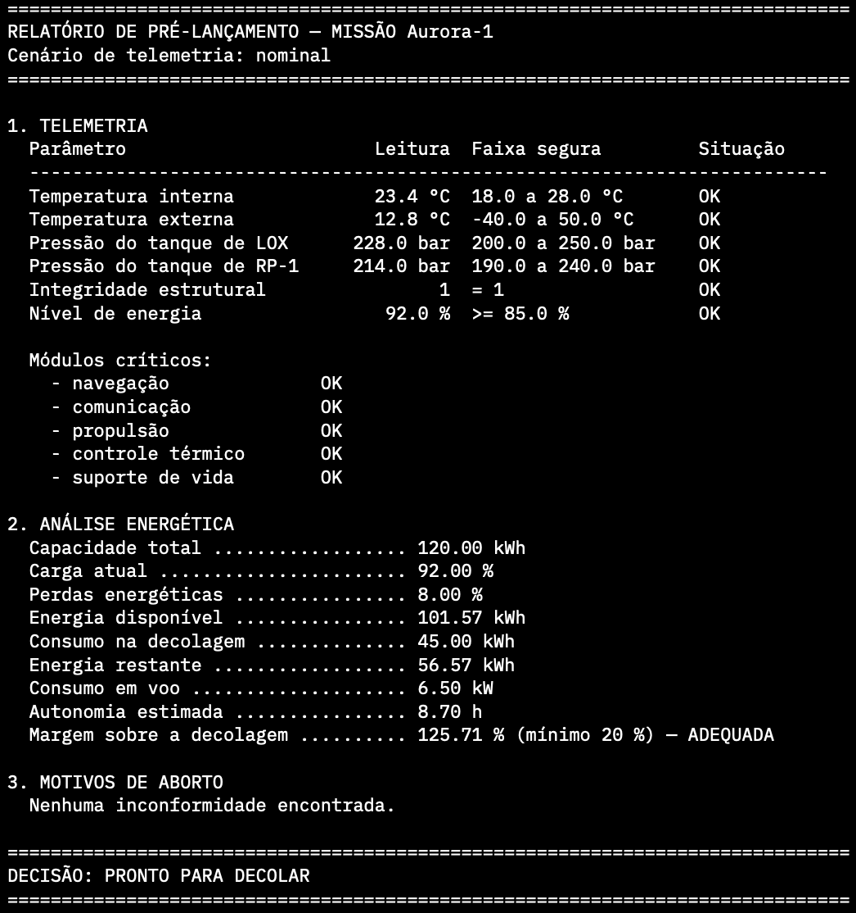
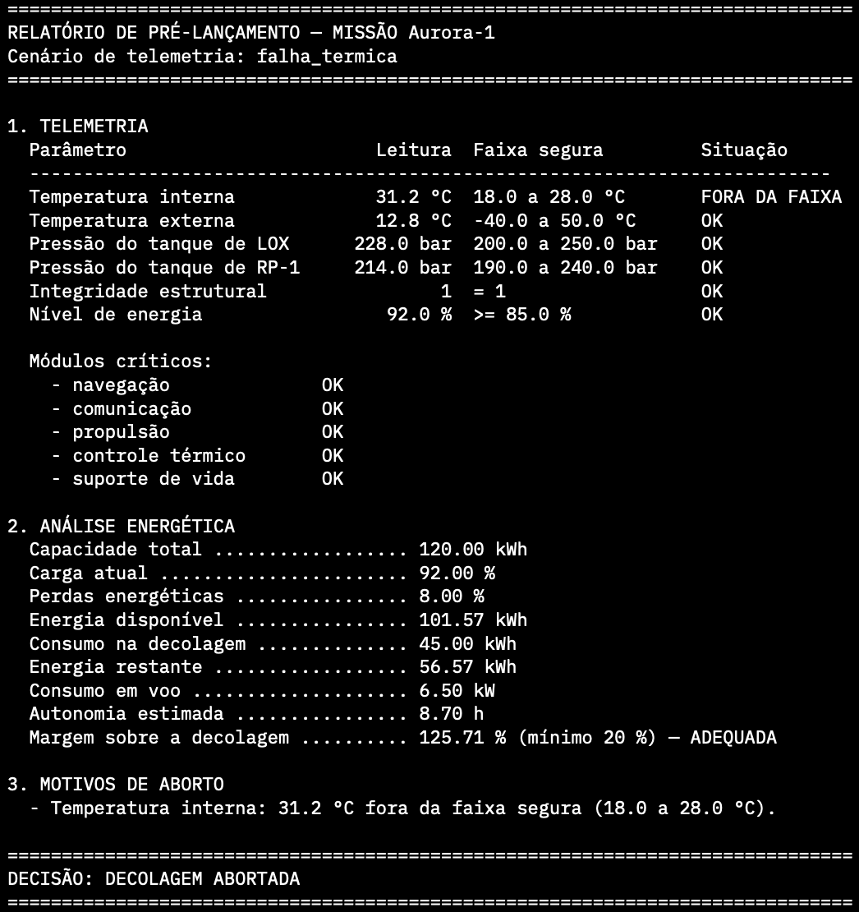
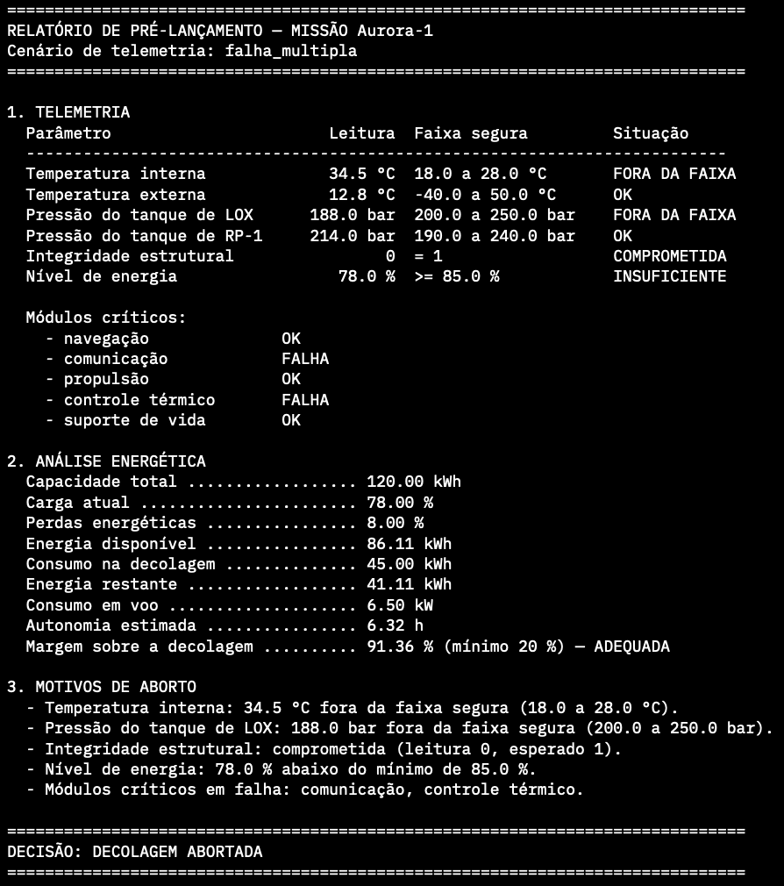

# Missão Aurora-1 — Verificação de Telemetria Pré-Lançamento

**FIAP — Atividade Integradora, Fase 1**

| | |
|---|---|
| **Nome completo** | `<!-- PREENCHER -->` |
| **RM** | `<!-- PREENCHER -->` |
| **Turma** | `<!-- PREENCHER -->` |

---

## O projeto

Um foguete está na janela final de contagem regressiva e é preciso decidir,
em poucos minutos, se a decolagem pode ser autorizada a partir da telemetria
capturada nos instantes anteriores ao lançamento. Essa decisão não pode
depender de uma leitura apressada de vários painéis por um operador sob
pressão de tempo: ela precisa ser determinística, verificar todos os
parâmetros relevantes e, no caso de aborto, explicar exatamente por quê — sem
esconder nenhum motivo atrás do primeiro que for encontrado.

A solução implementada é um checklist de verificação pré-lançamento que lê a
telemetria de um cenário, aplica sete verificações de segurança (temperaturas
interna e externa, pressão dos dois tanques de propelente, integridade
estrutural, nível de energia e estado dos módulos críticos) e só libera a
decolagem se **todas** passarem. Nenhuma verificação interrompe a avaliação
das demais: se houver mais de um problema, o relatório final lista todos os
motivos de aborto de uma só vez, em uma única execução. Uma análise energética
complementar calcula a energia disponível, a energia restante após a
decolagem, a autonomia de voo e a margem de segurança sobre o consumo da
decolagem — informação reportada ao operador, mas que não substitui a decisão
de lançamento, que depende apenas das leituras diretas do veículo.

O que foi entregue é o algoritmo em `src/missao.py`, executável por linha de
comando para qualquer um dos três cenários de `data/telemetria.json`; uma
suíte de 28 testes automatizados em `tests/test_missao.py`, com ênfase nos
pontos de fronteira das faixas seguras; um notebook de análise em
`notebooks/analise_telemetria.ipynb`; e a documentação completa em `docs/` —
relatório técnico (Markdown e PDF), fluxograma e pseudocódigo do algoritmo.

## Estrutura do repositório

```
entrega-fase1/
├── README.md                     # este arquivo
├── requirements.txt              # dependências para testes e notebook (não para o script)
├── data/
│   └── telemetria.json           # cenários: nominal, falha_termica, falha_multipla
├── src/
│   └── missao.py                 # lógica de verificação e CLI (só biblioteca padrão)
├── tests/
│   └── test_missao.py            # 28 casos de teste automatizados
├── notebooks/
│   └── analise_telemetria.ipynb  # análise executada, com outputs
└── docs/
    ├── relatorio.md               # relatório técnico completo
    ├── relatorio.pdf              # o mesmo relatório, em PDF (27 páginas)
    ├── fluxograma.md               # fluxograma do algoritmo (Mermaid)
    ├── fluxograma.png              # o mesmo fluxograma, como imagem
    ├── pseudocodigo.md             # pseudocódigo do algoritmo
    └── prints/                     # prints de execução (ver seção abaixo)
```

## Como executar

### Requisitos

Python 3.10 ou superior. O código de `src/` usa apenas a biblioteca padrão do
Python — nenhuma dependência externa é necessária para rodar o verificador.

### Executar o script

```bash
cd entrega-fase1
python src/missao.py                  # cenário nominal
python src/missao.py falha_termica    # aborto por temperatura
python src/missao.py falha_multipla   # aborto com cinco motivos
```

### Ambiente virtual (para testes e notebook)

O script principal não precisa disso — só os testes e o notebook, que
dependem de pacotes externos. Para não instalar nada no Python do sistema,
crie e ative um ambiente virtual antes dos `pip install` das duas seções
abaixo:

```bash
python3 -m venv .venv
source .venv/bin/activate   # Windows: .venv\Scripts\activate
```

### Abrir o notebook

```bash
pip install -r requirements.txt
jupyter notebook notebooks/analise_telemetria.ipynb
```

Para rodar no Google Colab, faça upload do notebook (ou abra-o direto do
repositório) e descomente a célula inicial que clona o repositório — ela
existe justamente para que o notebook encontre `src/missao.py` e
`data/telemetria.json` num ambiente que não tem o restante do projeto no
disco. Ao descomentar, substitua também `SEU_USUARIO` e `SEU_REPOSITORIO`
pelos valores reais do repositório, nas duas linhas (a do `git clone` e a do
`%cd`) — os nomes na célula são placeholders, não valores prontos para uso.

### Rodar os testes

```bash
pip install pytest
pytest tests/ -v
```

## Prints da execução

<!-- Substituir pelos seus prints: salve em docs/prints/ com estes nomes -->

### Cenário nominal — PRONTO PARA DECOLAR



```text
==============================================================================
RELATÓRIO DE PRÉ-LANÇAMENTO — MISSÃO Aurora-1
Cenário de telemetria: nominal
==============================================================================

1. TELEMETRIA
  Parâmetro                       Leitura  Faixa segura         Situação
  --------------------------------------------------------------------------
  Temperatura interna             23.4 °C  18.0 a 28.0 °C       OK
  Temperatura externa             12.8 °C  -40.0 a 50.0 °C      OK
  Pressão do tanque de LOX      228.0 bar  200.0 a 250.0 bar    OK
  Pressão do tanque de RP-1     214.0 bar  190.0 a 240.0 bar    OK
  Integridade estrutural                1  = 1                  OK
  Nível de energia                 92.0 %  >= 85.0 %            OK

  Módulos críticos:
    - navegação              OK
    - comunicação            OK
    - propulsão              OK
    - controle térmico       OK
    - suporte de vida        OK

2. ANÁLISE ENERGÉTICA
  Capacidade total .................. 120.00 kWh
  Carga atual ....................... 92.00 %
  Perdas energéticas ................ 8.00 %
  Energia disponível ................ 101.57 kWh
  Consumo na decolagem .............. 45.00 kWh
  Energia restante .................. 56.57 kWh
  Consumo em voo .................... 6.50 kW
  Autonomia estimada ................ 8.70 h
  Margem sobre a decolagem .......... 125.71 % (mínimo 20 %) — ADEQUADA

3. MOTIVOS DE ABORTO
  Nenhuma inconformidade encontrada.

==============================================================================
DECISÃO: PRONTO PARA DECOLAR
==============================================================================
```

### Cenário de falha térmica — DECOLAGEM ABORTADA



```text
==============================================================================
RELATÓRIO DE PRÉ-LANÇAMENTO — MISSÃO Aurora-1
Cenário de telemetria: falha_termica
==============================================================================

1. TELEMETRIA
  Parâmetro                       Leitura  Faixa segura         Situação
  --------------------------------------------------------------------------
  Temperatura interna             31.2 °C  18.0 a 28.0 °C       FORA DA FAIXA
  Temperatura externa             12.8 °C  -40.0 a 50.0 °C      OK
  Pressão do tanque de LOX      228.0 bar  200.0 a 250.0 bar    OK
  Pressão do tanque de RP-1     214.0 bar  190.0 a 240.0 bar    OK
  Integridade estrutural                1  = 1                  OK
  Nível de energia                 92.0 %  >= 85.0 %            OK

  Módulos críticos:
    - navegação              OK
    - comunicação            OK
    - propulsão              OK
    - controle térmico       OK
    - suporte de vida        OK

2. ANÁLISE ENERGÉTICA
  Capacidade total .................. 120.00 kWh
  Carga atual ....................... 92.00 %
  Perdas energéticas ................ 8.00 %
  Energia disponível ................ 101.57 kWh
  Consumo na decolagem .............. 45.00 kWh
  Energia restante .................. 56.57 kWh
  Consumo em voo .................... 6.50 kW
  Autonomia estimada ................ 8.70 h
  Margem sobre a decolagem .......... 125.71 % (mínimo 20 %) — ADEQUADA

3. MOTIVOS DE ABORTO
  - Temperatura interna: 31.2 °C fora da faixa segura (18.0 a 28.0 °C).

==============================================================================
DECISÃO: DECOLAGEM ABORTADA
==============================================================================
```

### Cenário de falha múltipla — DECOLAGEM ABORTADA



```text
==============================================================================
RELATÓRIO DE PRÉ-LANÇAMENTO — MISSÃO Aurora-1
Cenário de telemetria: falha_multipla
==============================================================================

1. TELEMETRIA
  Parâmetro                       Leitura  Faixa segura         Situação
  --------------------------------------------------------------------------
  Temperatura interna             34.5 °C  18.0 a 28.0 °C       FORA DA FAIXA
  Temperatura externa             12.8 °C  -40.0 a 50.0 °C      OK
  Pressão do tanque de LOX      188.0 bar  200.0 a 250.0 bar    FORA DA FAIXA
  Pressão do tanque de RP-1     214.0 bar  190.0 a 240.0 bar    OK
  Integridade estrutural                0  = 1                  COMPROMETIDA
  Nível de energia                 78.0 %  >= 85.0 %            INSUFICIENTE

  Módulos críticos:
    - navegação              OK
    - comunicação            FALHA
    - propulsão              OK
    - controle térmico       FALHA
    - suporte de vida        OK

2. ANÁLISE ENERGÉTICA
  Capacidade total .................. 120.00 kWh
  Carga atual ....................... 78.00 %
  Perdas energéticas ................ 8.00 %
  Energia disponível ................ 86.11 kWh
  Consumo na decolagem .............. 45.00 kWh
  Energia restante .................. 41.11 kWh
  Consumo em voo .................... 6.50 kW
  Autonomia estimada ................ 6.32 h
  Margem sobre a decolagem .......... 91.36 % (mínimo 20 %) — ADEQUADA

3. MOTIVOS DE ABORTO
  - Temperatura interna: 34.5 °C fora da faixa segura (18.0 a 28.0 °C).
  - Pressão do tanque de LOX: 188.0 bar fora da faixa segura (200.0 a 250.0 bar).
  - Integridade estrutural: comprometida (leitura 0, esperado 1).
  - Nível de energia: 78.0 % abaixo do mínimo de 85.0 %.
  - Módulos críticos em falha: comunicação, controle térmico.

==============================================================================
DECISÃO: DECOLAGEM ABORTADA
==============================================================================
```

## Documentação

- [Relatório completo (PDF)](docs/relatorio.pdf)
- [Relatório completo (Markdown)](docs/relatorio.md)
- [Fluxograma do algoritmo](docs/fluxograma.md)
- [Pseudocódigo do algoritmo](docs/pseudocodigo.md)

## Premissas

Os dados de telemetria e as faixas seguras de cada parâmetro não foram
fornecidos pelo enunciado da atividade: foram definidos por nós, com as
justificativas de engenharia registradas no relatório completo
(`docs/relatorio.md`, seção "Premissas do projeto").
