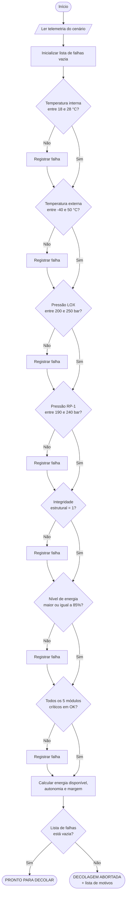

# Fluxograma do algoritmo de verificação

O diagrama abaixo está em Mermaid e é renderizado automaticamente pelo GitHub.

**Ponto central do desenho:** nenhuma resposta "Não" salta para o fim. Cada
verificação registra sua falha e segue para a próxima, de modo que o operador
receba a lista completa de problemas em uma única passagem — e não descubra um
problema por vez a cada tentativa de lançamento.
