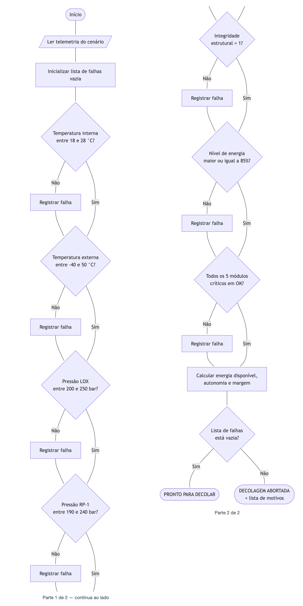
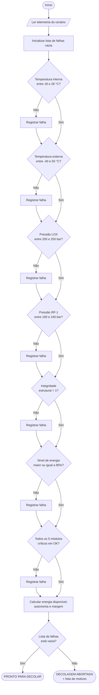

# Missão Aurora-1 — Relatório de Verificação Pré-Lançamento

**Atividade Integradora — FIAP, Fase 1**

| | |
|---|---|
| **Nome completo** | `<!-- PREENCHER -->` |
| **RM** | `<!-- PREENCHER -->` |
| **Turma** | `<!-- PREENCHER -->` |
| **Data** | 15 de setembro de 2026 |
| **Repositório** | `<!-- PREENCHER -->` |

---

## Premissas do projeto

O enunciado da atividade descreve a situação — um foguete na janela final de
contagem regressiva, cuja telemetria precisa ser verificada antes da decolagem
— mas **não fornece os dados de telemetria nem as faixas seguras de cada
parâmetro**. Nós os definimos. Este relatório declara isso logo no início
porque a nota de um verificador não está na precisão dos números escolhidos, e
sim em o critério estar explícito, justificado e implementado exatamente como
descrito. Um limite não documentado é indistinguível de um limite inventado na
hora.

Os valores que adotamos são plausíveis para um veículo lançador de carga com
propelentes criogênicos LOX/RP-1 (oxigênio líquido e querosene de foguete), na
faixa de porte de um lançador de pequeno porte, e foram escolhidos por
analogia com ordens de grandeza publicamente conhecidas desse tipo de veículo.
Eles **não representam um veículo real**, não foram obtidos de nenhuma
documentação de voo e não devem ser usados para nenhuma finalidade fora deste
trabalho acadêmico. Do mesmo modo, os três cenários de telemetria do arquivo
`data/telemetria.json` são sintéticos: foram construídos por nós para exercitar
os três comportamentos que o algoritmo precisa demonstrar — aprovação, aborto
por uma única causa e aborto por causas múltiplas.

O que **não** é premissa arbitrária é a relação entre documento e código. Todo
número que aparece neste relatório foi conferido contra a execução real de
`src/missao.py`; as saídas transcritas nas seções 3 e 4 são cópias literais do
que o programa imprime no terminal. Se um limite for alterado no código, este
relatório passa a estar errado — e é assim que deve ser: há uma única fonte da
verdade, que é o módulo, e a documentação é derivada dela.

---

## 1. Organização e descrição da telemetria

A telemetria fica separada do código, em `entrega-fase1/data/telemetria.json`.
Essa separação é deliberada: dado de missão é insumo, não lógica. Trocar o
cenário analisado não deve exigir editar o programa, e o mesmo programa deve
poder ser apontado para outro arquivo de leituras sem nenhuma alteração.

São sete parâmetros monitorados, agrupados em quatro famílias de verificação:
faixa com mínimo e máximo, valor binário, mínimo apenas, e estado nominal de
componentes.

| Parâmetro | Chave no JSON | Unidade | Faixa segura | Leitura nominal |
|---|---|---|---|---|
| Temperatura interna (aviônica) | `temperatura_interna_c` | °C | 18,0 a 28,0 | 23,4 |
| Temperatura externa (fuselagem) | `temperatura_externa_c` | °C | −40,0 a 50,0 | 12,8 |
| Integridade estrutural | `integridade_estrutural` | 0 ou 1 | = 1 | 1 |
| Nível de energia | `nivel_energia_pct` | % | ≥ 85,0 | 92,0 |
| Pressão do tanque de LOX | `pressao_lox_bar` | bar | 200,0 a 250,0 | 228,0 |
| Pressão do tanque de RP-1 | `pressao_rp1_bar` | bar | 190,0 a 240,0 | 214,0 |
| Módulos críticos | `modulos_criticos` | `OK` / `FALHA` | todos em `OK` | todos em `OK` |

Os limites numéricos são **inclusivos**: uma leitura de exatamente 28,0 °C é
aprovada. A faixa segura é o intervalo fechado, e essa escolha está registrada
tanto no pseudocódigo quanto em testes automatizados, para que não dependa da
leitura que cada pessoa faz do código.

### Por que cada faixa é aquela

**Temperatura interna — 18 °C a 28 °C.** É o compartimento da aviônica. Os
componentes eletrônicos que respondem pela navegação e pelo controle de voo têm
sua deriva de calibração especificada para uma faixa estreita de temperatura;
fora dela, o sensor continua produzindo leituras — apenas leituras erradas, o
que é pior do que nenhuma leitura. A faixa é estreita porque o compartimento é
climatizado ativamente: não estamos medindo o ambiente, estamos medindo se o
controle térmico está cumprindo seu trabalho. Um desvio aqui é, quase sempre,
sintoma de outra falha.

**Temperatura externa — −40 °C a 50 °C.** É a pele do veículo, exposta ao
ambiente da plataforma. A faixa é ampla de propósito: a fuselagem é projetada
para tolerar variação térmica muito maior do que a aviônica, e um lançamento
pode ocorrer em madrugada fria ou em tarde de sol direto sobre a estrutura. O
que essa verificação captura não é o desconforto térmico, e sim a condição
extrema — formação de gelo na estrutura, ou aquecimento que comprometa
vedações e o carregamento estrutural do veículo. Por isso ela quase nunca
dispara, e é justamente essa a intenção.

**Integridade estrutural — deve ser exatamente 1.** Este é o único parâmetro
binário do conjunto, e é binário porque não existe meio-termo aceitável em
estrutura. Não há "integridade parcial" sobre a qual se possa negociar um
lançamento: ou a estrutura está íntegra, ou o veículo não voa. Modelar isso
como um valor contínuo com faixa de tolerância seria criar a possibilidade de
alguém, sob pressão de janela de lançamento, argumentar que a leitura está
"quase" dentro. O tipo do dado fecha essa porta.

**Nível de energia — mínimo de 85 %.** Aqui só existe limite inferior, porque
excesso de carga não é um problema de segurança. O corte em 85 % é mais
rigoroso do que o estritamente necessário para completar o perfil de voo
planejado (a seção 4 mostra que o balanço energético fecha com folga bem
abaixo disso). Essa severidade é intencional: a reserva cobre o que o modelo
energético não prevê — consumo adicional em contingência, degradação da
bateria, tempo extra em espera na plataforma por atraso na janela. Carga
abaixo de 85 % não significa que a missão vá falhar; significa que perdemos a
margem que nos permite lidar com o imprevisto.

**Pressões dos tanques — LOX de 200 a 250 bar, RP-1 de 190 a 240 bar.** Os
tanques são pressurizados para alimentar as turbobombas com pressão de sucção
adequada. Fora da faixa, em qualquer direção, há um problema físico concreto:
pressão **abaixo** do mínimo indica vazamento, falha no sistema de
pressurização ou perda de contenção — e, além de comprometer a alimentação dos
motores, um vazamento de oxidante na plataforma é risco de incêndio para o
pessoal em solo; pressão **acima** do máximo é sobrepressurização, que solicita
o vaso de pressão além do projeto e pode levar à ruptura. As duas faixas são
diferentes entre si porque os propelentes são diferentes: o LOX é criogênico e
opera com pressão de vapor mais alta, enquanto o RP-1 é armazenado à
temperatura ambiente. Manter faixas distintas também nos dá um sinal de
diagnóstico útil — uma queda em apenas um dos lados aponta para um problema
localizado naquele circuito, e não para uma falha do sistema de pressurização
comum.

**Módulos críticos — navegação, comunicação, propulsão, controle térmico e
suporte de vida.** São os cinco subsistemas que, na configuração deste
veículo, **não têm redundância**: se um deles reporta `FALHA`, não existe
unidade reserva assumindo a função. Esse é exatamente o critério que os torna
"críticos" — não a importância abstrata do subsistema, mas a ausência de plano
B. Subsistemas redundantes poderiam operar degradados e ainda assim permitir o
lançamento; estes, não. A verificação é por estado nominal (`OK`) e não por
percentual de saúde, pela mesma razão do parâmetro de integridade: estado
parcial de um sistema sem redundância não é uma condição sobre a qual se
autorize decolagem.

### Os três cenários do arquivo de telemetria

O JSON traz três conjuntos de leituras, todos na mesma janela de T−10 min:

- **`nominal`** — todas as leituras dentro das faixas, integridade em 1, carga
  em 92 %, cinco módulos em `OK`. É o caso de referência: o veículo está apto e
  o algoritmo deve liberar a decolagem. Serve para verificar que o sistema não
  é excessivamente conservador a ponto de abortar voos válidos — um verificador
  que nunca aprova é tão inútil quanto um que nunca reprova.

- **`falha_termica`** — idêntico ao nominal, exceto pela temperatura interna em
  31,2 °C, 3,2 °C acima do teto. É o cenário de **causa única**: mostra que o
  aborto é disparado por um parâmetro isolado, que o motivo é identificado com
  precisão e que nenhum outro item é reportado como problema por arrasto. O
  desvio é pequeno e deliberadamente próximo do limite, para exercitar a
  fronteira da decisão.

- **`falha_multipla`** — cinco famílias de problema ao mesmo tempo:
  temperatura interna em 34,5 °C, pressão de LOX em 188 bar, integridade
  estrutural em 0, carga em 78 % e dois módulos críticos (`comunicacao` e
  `controle_termico`) em `FALHA`. É o cenário que valida a decisão de projeto
  mais importante do algoritmo: ele **não para na primeira falha**. O operador
  recebe a lista completa dos cinco motivos em uma única passagem, em vez de
  descobrir um problema por vez a cada nova tentativa.

---

## 2. Algoritmo de verificação

A regra de decisão é conjuntiva: o lançamento é liberado **somente se todas**
as verificações passarem. Basta uma reprovação para que a decisão seja
`DECOLAGEM ABORTADA`. Não há ponderação, escore agregado nem compensação entre
parâmetros — uma pressão excelente não compensa uma estrutura comprometida.

### 2.1 Fluxograma



O diagrama é uma sequência vertical longa; para caber em uma página, ele está
dividido em duas colunas — a primeira termina na verificação da pressão de
RP-1 e a segunda retoma na verificação de integridade estrutural. O código-fonte
Mermaid que o gera está reproduzido abaixo e é renderizado como diagrama
diretamente pelo GitHub:



Observe que nenhuma resposta "Não" salta para o fim do diagrama. Cada
verificação registra sua falha e o fluxo segue para a próxima; só depois de
todas é que a lista de falhas é consultada para produzir a decisão.

### 2.2 Pseudocódigo

```
ALGORITMO VerificacaoPreLancamento

CONSTANTES
    TEMP_INTERNA_MIN   <- 18.0     TEMP_INTERNA_MAX   <- 28.0     // °C
    TEMP_EXTERNA_MIN   <- -40.0    TEMP_EXTERNA_MAX   <- 50.0     // °C
    PRESSAO_LOX_MIN    <- 200.0    PRESSAO_LOX_MAX    <- 250.0    // bar
    PRESSAO_RP1_MIN    <- 190.0    PRESSAO_RP1_MAX    <- 240.0    // bar
    ENERGIA_MINIMA     <- 85.0                                    // %
    MODULOS_CRITICOS   <- [navegação, comunicação, propulsão,
                           controle térmico, suporte de vida]
    CAPACIDADE_TOTAL   <- 120.0    // kWh
    PERDAS             <- 8.0      // %
    CONSUMO_DECOLAGEM  <- 45.0     // kWh
    CONSUMO_VOO        <- 6.5      // kW
    MARGEM_MINIMA      <- 20.0     // %

INÍCIO
    LER telemetria DO cenário escolhido
    falhas <- lista vazia

    // 1. Parâmetros com faixa de mínimo e máximo (limites inclusivos)
    SE NÃO (TEMP_INTERNA_MIN <= telemetria.temperatura_interna <= TEMP_INTERNA_MAX) ENTÃO
        ADICIONAR "Temperatura interna fora da faixa segura" EM falhas
    FIM SE
    SE NÃO (TEMP_EXTERNA_MIN <= telemetria.temperatura_externa <= TEMP_EXTERNA_MAX) ENTÃO
        ADICIONAR "Temperatura externa fora da faixa segura" EM falhas
    FIM SE
    SE NÃO (PRESSAO_LOX_MIN <= telemetria.pressao_lox <= PRESSAO_LOX_MAX) ENTÃO
        ADICIONAR "Pressão do tanque de LOX fora da faixa segura" EM falhas
    FIM SE
    SE NÃO (PRESSAO_RP1_MIN <= telemetria.pressao_rp1 <= PRESSAO_RP1_MAX) ENTÃO
        ADICIONAR "Pressão do tanque de RP-1 fora da faixa segura" EM falhas
    FIM SE

    // 2. Parâmetro binário
    SE telemetria.integridade_estrutural <> 1 ENTÃO
        ADICIONAR "Integridade estrutural comprometida" EM falhas
    FIM SE

    // 3. Parâmetro com mínimo apenas
    SE telemetria.nivel_energia < ENERGIA_MINIMA ENTÃO
        ADICIONAR "Nível de energia abaixo do mínimo" EM falhas
    FIM SE

    // 4. Estado dos módulos críticos
    modulos_em_falha <- lista vazia
    PARA CADA modulo EM MODULOS_CRITICOS FAÇA
        SE telemetria.modulos_criticos[modulo] <> "OK" ENTÃO
            ADICIONAR modulo EM modulos_em_falha
        FIM SE
    FIM PARA
    SE modulos_em_falha NÃO ESTÁ VAZIA ENTÃO
        ADICIONAR "Módulos críticos em falha: " + modulos_em_falha EM falhas
    FIM SE

    // 5. Balanço energético (informativo, não bloqueia a decisão)
    disponivel <- CAPACIDADE_TOTAL * (telemetria.nivel_energia / 100)
                                   * (1 - PERDAS / 100)
    restante   <- disponivel - CONSUMO_DECOLAGEM
    SE restante > 0 ENTÃO
        autonomia <- restante / CONSUMO_VOO
    SENÃO
        autonomia <- 0
    FIM SE
    margem <- (restante / CONSUMO_DECOLAGEM) * 100
    SE margem >= MARGEM_MINIMA ENTÃO
        parecer_energetico <- "ADEQUADA"
    SENÃO
        parecer_energetico <- "INSUFICIENTE"
    FIM SE

    // 6. Decisão
    SE falhas ESTÁ VAZIA ENTÃO
        decisao <- "PRONTO PARA DECOLAR"
    SENÃO
        decisao <- "DECOLAGEM ABORTADA"
    FIM SE

    ESCREVER telemetria, disponivel, restante, autonomia, margem,
             parecer_energetico
    ESCREVER decisao
    SE falhas NÃO ESTÁ VAZIA ENTÃO
        ESCREVER cada item de falhas
    FIM SE
FIM
```

### 2.3 Três decisões de projeto

**1. Os limites são inclusivos.** Uma leitura de exatamente 28,0 °C ou de
exatamente 85,0 % de carga é aprovada. A faixa segura é o intervalo fechado,
não o aberto. Ambiguidade em limite de segurança é fonte clássica de erro
por um valor de diferença, e a escolha está fixada por testes automatizados que
verificam exatamente os pontos de fronteira — não depende de quem lê o código.

**2. A avaliação nunca interrompe na primeira falha.** Seria mais simples, e
computacionalmente mais barato, retornar assim que a primeira reprovação
aparecesse. Rejeitamos essa alternativa porque ela produz um relatório de
aborto enganoso: o operador corrigiria a temperatura, rodaria de novo,
descobriria a pressão, corrigiria, rodaria de novo — gastando janela de
lançamento para obter, em N tentativas, a informação que cabia em uma. Pior,
ele terminaria a primeira rodada com a impressão falsa de que a temperatura era
o único problema do veículo. O custo de avaliar tudo é desprezível; o custo de
esconder informação de quem decide, não.

**3. A análise energética não bloqueia a decisão de lançamento.** Ela produz um
parecer próprio — margem `ADEQUADA` ou `INSUFICIENTE` — que é reportado
separadamente. A verificação que de fato bloqueia o lançamento é o nível
mínimo de carga (≥ 85 %), no item 3 do algoritmo. A separação é intencional: a
carga é uma medida direta, lida do veículo, enquanto a margem é resultado de um
**modelo** de consumo, que traz premissas sobre o perfil da missão. Misturar as
duas coisas na mesma porta de decisão faria a autorização de voo depender da
qualidade de um modelo, e não apenas de uma leitura. A seção 4 mostra
concretamente por que essa separação importa.

---

## 3. Script em Python

Toda a lógica está em um único módulo sem estado, `entrega-fase1/src/missao.py`,
com funções puras e dois dataclasses de resultado. O módulo usa **apenas a
biblioteca padrão do Python** (versão 3.10 ou superior) — não há dependência
externa para executar a verificação. `pytest` e `jupyter`, listados em
`requirements.txt`, servem somente para rodar os testes e o notebook.

### 3.1 Código-fonte de `src/missao.py`

```python
"""Verificação de telemetria pré-lançamento da missão Aurora-1.

Módulo sem estado: todas as funções são puras e recebem os dados de que
precisam. Usa apenas a biblioteca padrão do Python.
"""

from __future__ import annotations

from dataclasses import dataclass
import json
from pathlib import Path

CAMINHO_PADRAO = Path(__file__).resolve().parents[1] / "data" / "telemetria.json"

# Faixas seguras (mínimo e máximo inclusivos) definidas como premissa do projeto.
FAIXAS: dict[str, tuple[float, float]] = {
    "temperatura_interna_c": (18.0, 28.0),
    "temperatura_externa_c": (-40.0, 50.0),
    "pressao_lox_bar": (200.0, 250.0),
    "pressao_rp1_bar": (190.0, 240.0),
}

ENERGIA_MINIMA_PCT = 85.0

MODULOS_CRITICOS: tuple[str, ...] = (
    "navegacao",
    "comunicacao",
    "propulsao",
    "controle_termico",
    "suporte_vida",
)

ROTULOS: dict[str, str] = {
    "temperatura_interna_c": "Temperatura interna",
    "temperatura_externa_c": "Temperatura externa",
    "integridade_estrutural": "Integridade estrutural",
    "nivel_energia_pct": "Nível de energia",
    "pressao_lox_bar": "Pressão do tanque de LOX",
    "pressao_rp1_bar": "Pressão do tanque de RP-1",
    "modulos_criticos": "Módulos críticos",
    "navegacao": "navegação",
    "comunicacao": "comunicação",
    "propulsao": "propulsão",
    "controle_termico": "controle térmico",
    "suporte_vida": "suporte de vida",
}

UNIDADES: dict[str, str] = {
    "temperatura_interna_c": "°C",
    "temperatura_externa_c": "°C",
    "nivel_energia_pct": "%",
    "pressao_lox_bar": "bar",
    "pressao_rp1_bar": "bar",
}


def carregar_telemetria(caminho: str | Path = CAMINHO_PADRAO,
                        cenario: str = "nominal") -> dict:
    """Lê o arquivo de telemetria e devolve as leituras de um cenário."""
    with open(caminho, encoding="utf-8") as arquivo:
        conteudo = json.load(arquivo)
    cenarios = conteudo["cenarios"]
    if cenario not in cenarios:
        disponiveis = ", ".join(sorted(cenarios))
        raise KeyError(
            f"Cenário '{cenario}' inexistente. Disponíveis: {disponiveis}."
        )
    return cenarios[cenario]


DECISAO_APROVADA = "PRONTO PARA DECOLAR"
DECISAO_ABORTADA = "DECOLAGEM ABORTADA"


@dataclass(frozen=True)
class ResultadoVerificacao:
    """Veredito do checklist pré-lançamento."""

    aprovado: bool
    decisao: str
    falhas: tuple[str, ...]


def verificar_telemetria(dados: dict) -> ResultadoVerificacao:
    """Aplica todas as verificações de segurança e decide sobre o lançamento.

    Avalia todos os parâmetros antes de decidir: um relatório de aborto que
    parasse na primeira falha esconderia problemas do operador.
    """
    falhas: list[str] = []

    for chave, (mínimo, máximo) in FAIXAS.items():
        valor = dados[chave]
        if not mínimo <= valor <= máximo:
            unidade = UNIDADES[chave]
            falhas.append(
                f"{ROTULOS[chave]}: {valor} {unidade} fora da faixa segura "
                f"({mínimo} a {máximo} {unidade})."
            )

    if dados["integridade_estrutural"] != 1:
        falhas.append(
            f"{ROTULOS['integridade_estrutural']}: comprometida "
            f"(leitura {dados['integridade_estrutural']}, esperado 1)."
        )

    energia = dados["nivel_energia_pct"]
    if energia < ENERGIA_MINIMA_PCT:
        falhas.append(
            f"{ROTULOS['nivel_energia_pct']}: {energia} % abaixo do mínimo de "
            f"{ENERGIA_MINIMA_PCT} %."
        )

    modulos = dados["modulos_criticos"]
    em_falha = [ROTULOS[nome] for nome in MODULOS_CRITICOS
                if modulos.get(nome) != "OK"]
    if em_falha:
        falhas.append(
            f"{ROTULOS['modulos_criticos']} em falha: {', '.join(em_falha)}."
        )

    aprovado = not falhas
    return ResultadoVerificacao(
        aprovado=aprovado,
        decisao=DECISAO_APROVADA if aprovado else DECISAO_ABORTADA,
        falhas=tuple(falhas),
    )


# Parâmetros energéticos do veículo (premissas do projeto).
CAPACIDADE_TOTAL_KWH = 120.0
PERDAS_PCT = 8.0
CONSUMO_DECOLAGEM_KWH = 45.0
CONSUMO_VOO_KW = 6.5
MARGEM_MINIMA_PCT = 20.0


@dataclass(frozen=True)
class ResultadoEnergia:
    """Balanço energético da missão."""

    disponivel_kwh: float
    restante_kwh: float
    autonomia_h: float
    margem_pct: float
    aprovado: bool


def analisar_energia(
    carga_pct: float,
    capacidade_kwh: float = CAPACIDADE_TOTAL_KWH,
    perdas_pct: float = PERDAS_PCT,
    consumo_decolagem_kwh: float = CONSUMO_DECOLAGEM_KWH,
    consumo_voo_kw: float = CONSUMO_VOO_KW,
) -> ResultadoEnergia:
    """Calcula energia disponível, autonomia de voo e margem de segurança.

    A autonomia é o tempo de voo sustentável com a energia que sobra depois
    da decolagem. Se não sobra energia, a autonomia é zero — nunca negativa.
    """
    disponivel = capacidade_kwh * (carga_pct / 100.0) * (1 - perdas_pct / 100.0)
    restante = disponivel - consumo_decolagem_kwh
    autonomia = restante / consumo_voo_kw if restante > 0 else 0.0
    margem = (restante / consumo_decolagem_kwh) * 100.0
    return ResultadoEnergia(
        disponivel_kwh=disponivel,
        restante_kwh=restante,
        autonomia_h=autonomia,
        margem_pct=margem,
        aprovado=margem >= MARGEM_MINIMA_PCT,
    )


def _linha_parametro(chave: str, valor, faixa: str, situacao: str) -> str:
    return f"  {ROTULOS[chave]:<28} {str(valor):>10}  {faixa:<20} {situacao}"


def formatar_relatorio(dados: dict, verificacao: ResultadoVerificacao,
                       energia: ResultadoEnergia, cenario: str) -> str:
    """Monta o relatório de pré-lançamento em texto puro."""
    linhas: list[str] = []
    linhas.append("=" * 78)
    linhas.append("RELATÓRIO DE PRÉ-LANÇAMENTO — MISSÃO Aurora-1")
    linhas.append(f"Cenário de telemetria: {cenario}")
    linhas.append("=" * 78)
    linhas.append("")
    linhas.append("1. TELEMETRIA")
    linhas.append(
        f"  {'Parâmetro':<28} {'Leitura':>10}  {'Faixa segura':<20} Situação"
    )
    linhas.append("  " + "-" * 74)

    for chave, (mínimo, máximo) in FAIXAS.items():
        valor = dados[chave]
        unidade = UNIDADES[chave]
        dentro = mínimo <= valor <= máximo
        linhas.append(_linha_parametro(
            chave, f"{valor} {unidade}", f"{mínimo} a {máximo} {unidade}",
            "OK" if dentro else "FORA DA FAIXA",
        ))

    integridade = dados["integridade_estrutural"]
    linhas.append(_linha_parametro(
        "integridade_estrutural", integridade, "= 1",
        "OK" if integridade == 1 else "COMPROMETIDA",
    ))

    energia_pct = dados["nivel_energia_pct"]
    linhas.append(_linha_parametro(
        "nivel_energia_pct", f"{energia_pct} %", f">= {ENERGIA_MINIMA_PCT} %",
        "OK" if energia_pct >= ENERGIA_MINIMA_PCT else "INSUFICIENTE",
    ))

    linhas.append("")
    linhas.append("  Módulos críticos:")
    for nome in MODULOS_CRITICOS:
        estado = dados["modulos_criticos"].get(nome, "DESCONHECIDO")
        linhas.append(f"    - {ROTULOS[nome]:<22} {estado}")

    linhas.append("")
    linhas.append("2. ANÁLISE ENERGÉTICA")
    linhas.append(f"  Capacidade total .................. {CAPACIDADE_TOTAL_KWH:.2f} kWh")
    linhas.append(f"  Carga atual ....................... {energia_pct:.2f} %")
    linhas.append(f"  Perdas energéticas ................ {PERDAS_PCT:.2f} %")
    linhas.append(f"  Energia disponível ................ {energia.disponivel_kwh:.2f} kWh")
    linhas.append(f"  Consumo na decolagem .............. {CONSUMO_DECOLAGEM_KWH:.2f} kWh")
    linhas.append(f"  Energia restante .................. {energia.restante_kwh:.2f} kWh")
    linhas.append(f"  Consumo em voo .................... {CONSUMO_VOO_KW:.2f} kW")
    linhas.append(f"  Autonomia estimada ................ {energia.autonomia_h:.2f} h")
    linhas.append(
        f"  Margem sobre a decolagem .......... {energia.margem_pct:.2f} % "
        f"(mínimo {MARGEM_MINIMA_PCT:.0f} %) — "
        f"{'ADEQUADA' if energia.aprovado else 'INSUFICIENTE'}"
    )

    linhas.append("")
    linhas.append("3. MOTIVOS DE ABORTO")
    if verificacao.falhas:
        linhas.extend(f"  - {falha}" for falha in verificacao.falhas)
    else:
        linhas.append("  Nenhuma inconformidade encontrada.")

    linhas.append("")
    linhas.append("=" * 78)
    linhas.append(f"DECISÃO: {verificacao.decisao}")
    linhas.append("=" * 78)
    return "\n".join(linhas)


def executar(cenario: str = "nominal",
             caminho: str | Path = CAMINHO_PADRAO) -> str:
    """Executa o fluxo completo e devolve o relatório de pré-lançamento."""
    dados = carregar_telemetria(caminho, cenario)
    verificacao = verificar_telemetria(dados)
    energia = analisar_energia(dados["nivel_energia_pct"])
    return formatar_relatorio(dados, verificacao, energia, cenario)


if __name__ == "__main__":
    import sys

    cenario_escolhido = sys.argv[1] if len(sys.argv) > 1 else "nominal"
    try:
        print(executar(cenario_escolhido))
    except KeyError as erro:
        # Cenário inexistente é erro de uso, não defeito: mensagem legível
        # em stderr e código de saída 1, sem traceback.
        print(f"Erro: {erro.args[0]}", file=sys.stderr)
        sys.exit(1)
```

### 3.2 Saída de `python src/missao.py nominal`

```text
==============================================================================
RELATÓRIO DE PRÉ-LANÇAMENTO — MISSÃO Aurora-1
Cenário de telemetria: nominal
==============================================================================

1. TELEMETRIA
  Parâmetro                       Leitura  Faixa segura         Situação
  --------------------------------------------------------------------------
  Temperatura interna             23.4 °C  18.0 a 28.0 °C       OK
  Temperatura externa             12.8 °C  -40.0 a 50.0 °C      OK
  Pressão do tanque de LOX      228.0 bar  200.0 a 250.0 bar    OK
  Pressão do tanque de RP-1     214.0 bar  190.0 a 240.0 bar    OK
  Integridade estrutural                1  = 1                  OK
  Nível de energia                 92.0 %  >= 85.0 %            OK

  Módulos críticos:
    - navegação              OK
    - comunicação            OK
    - propulsão              OK
    - controle térmico       OK
    - suporte de vida        OK

2. ANÁLISE ENERGÉTICA
  Capacidade total .................. 120.00 kWh
  Carga atual ....................... 92.00 %
  Perdas energéticas ................ 8.00 %
  Energia disponível ................ 101.57 kWh
  Consumo na decolagem .............. 45.00 kWh
  Energia restante .................. 56.57 kWh
  Consumo em voo .................... 6.50 kW
  Autonomia estimada ................ 8.70 h
  Margem sobre a decolagem .......... 125.71 % (mínimo 20 %) — ADEQUADA

3. MOTIVOS DE ABORTO
  Nenhuma inconformidade encontrada.

==============================================================================
DECISÃO: PRONTO PARA DECOLAR
==============================================================================
```

### 3.3 Saída de `python src/missao.py falha_multipla`

```text
==============================================================================
RELATÓRIO DE PRÉ-LANÇAMENTO — MISSÃO Aurora-1
Cenário de telemetria: falha_multipla
==============================================================================

1. TELEMETRIA
  Parâmetro                       Leitura  Faixa segura         Situação
  --------------------------------------------------------------------------
  Temperatura interna             34.5 °C  18.0 a 28.0 °C       FORA DA FAIXA
  Temperatura externa             12.8 °C  -40.0 a 50.0 °C      OK
  Pressão do tanque de LOX      188.0 bar  200.0 a 250.0 bar    FORA DA FAIXA
  Pressão do tanque de RP-1     214.0 bar  190.0 a 240.0 bar    OK
  Integridade estrutural                0  = 1                  COMPROMETIDA
  Nível de energia                 78.0 %  >= 85.0 %            INSUFICIENTE

  Módulos críticos:
    - navegação              OK
    - comunicação            FALHA
    - propulsão              OK
    - controle térmico       FALHA
    - suporte de vida        OK

2. ANÁLISE ENERGÉTICA
  Capacidade total .................. 120.00 kWh
  Carga atual ....................... 78.00 %
  Perdas energéticas ................ 8.00 %
  Energia disponível ................ 86.11 kWh
  Consumo na decolagem .............. 45.00 kWh
  Energia restante .................. 41.11 kWh
  Consumo em voo .................... 6.50 kW
  Autonomia estimada ................ 6.32 h
  Margem sobre a decolagem .......... 91.36 % (mínimo 20 %) — ADEQUADA

3. MOTIVOS DE ABORTO
  - Temperatura interna: 34.5 °C fora da faixa segura (18.0 a 28.0 °C).
  - Pressão do tanque de LOX: 188.0 bar fora da faixa segura (200.0 a 250.0 bar).
  - Integridade estrutural: comprometida (leitura 0, esperado 1).
  - Nível de energia: 78.0 % abaixo do mínimo de 85.0 %.
  - Módulos críticos em falha: comunicação, controle térmico.

==============================================================================
DECISÃO: DECOLAGEM ABORTADA
==============================================================================
```

As cinco linhas da seção 3 dessa saída são a demonstração prática da decisão de
projeto 2: o operador recebe, de uma só vez, todos os motivos do aborto.

### 3.4 Cobertura de testes

`entrega-fase1/tests/test_missao.py` traz 21 funções de teste que, com os casos
parametrizados, resultam em **29 casos executados — todos passando**
(`pytest entrega-fase1/tests/ -v`). A cobertura foi escrita em torno dos pontos
onde um verificador de segurança costuma errar, e não em torno da contagem de
linhas:

- **Fronteiras inclusivas** — cada parâmetro numérico é testado exatamente no
  mínimo e exatamente no máximo (aprovando), e logo fora deles (reprovando).
  É o teste que trava a decisão de projeto 1 contra regressão.
- **Cada parâmetro isoladamente** — um caso parametrizado leva cada uma das
  quatro grandezas com faixa para fora do intervalo, uma por vez, confirmando
  que cada uma aborta sozinha e que nenhuma depende das demais.
- **Parâmetros não numéricos** — integridade estrutural em 0 e em 1, e módulo
  crítico em `FALHA`.
- **Não parar na primeira falha** — um teste dedicado verifica que o cenário de
  falha múltipla reporta **todos** os motivos, não apenas o primeiro.
- **Cálculo energético** — conferido contra valores calculados à mão, incluindo
  um caso com perdas zeradas e números redondos (para que o teste seja legível
  e o erro, se houver, seja óbvio), um caso de margem abaixo do mínimo e o caso
  em que não sobra energia após a decolagem, no qual a autonomia deve ser zero
  e nunca negativa.
- **Coerência entre código e documento** — um teste compara as faixas do módulo
  com os valores especificados, de modo que uma alteração silenciosa de limite
  quebre a suíte em vez de passar despercebida.
- **Formatação e linha de comando** — o relatório de texto e a execução via
  `python src/missao.py <cenario>` também são exercitados, porque são a
  interface que o avaliador vai usar. Inclui o caso de erro de uso: um nome de
  cenário inexistente deve produzir mensagem legível em `stderr` e código de
  saída 1, e não um traceback.

---

## 4. Análise energética

### 4.1 Constantes do modelo

| Constante | Símbolo | Valor | Origem |
|---|---|---|---|
| Capacidade total da bateria | *C* | 120,00 kWh | Premissa do projeto |
| Carga atual (cenário nominal) | *q* | 92,00 % | Telemetria (`nivel_energia_pct`) |
| Perdas energéticas | *p* | 8,00 % | Premissa do projeto |
| Consumo na decolagem | *E*<sub>dec</sub> | 45,00 kWh | Premissa do projeto |
| Consumo em voo | *P*<sub>voo</sub> | 6,50 kW | Premissa do projeto |
| Margem mínima exigida | *M*<sub>min</sub> | 20,00 % | Premissa do projeto |

As perdas de 8 % representam a energia que não chega à carga útil —
autodescarga, ineficiência de conversão dos barramentos e dissipação em cabos.
Elas são aplicadas sobre a energia já corrigida pelo estado de carga, ou seja,
sobre o que a bateria de fato contém, e não sobre a capacidade nominal.

### 4.2 As quatro fórmulas com substituição numérica

**Energia disponível** — capacidade nominal corrigida pelo estado de carga e
descontadas as perdas:

```
E_disp = C × (q / 100) × (1 − p / 100)
       = 120,00 × (92,0 / 100) × (1 − 8,0 / 100)
       = 120,00 × 0,92 × 0,92
       = 110,40 × 0,92
       = 101,568 kWh
       ≈ 101,57 kWh
```

**Energia restante após a decolagem** — o que sobra depois de pagar o custo
fixo da subida:

```
E_rest = E_disp − E_dec
       = 101,568 − 45,00
       =  56,568 kWh
       ≈  56,57 kWh
```

**Autonomia de voo** — por quanto tempo a energia restante sustenta o consumo
de cruzeiro:

```
t_aut = E_rest / P_voo
      = 56,568 kWh / 6,50 kW
      =  8,7028 h
      ≈  8,70 h
```

O quociente entre uma energia em kWh e uma potência em kW resulta diretamente
em horas, o que dispensa fator de conversão. Se `E_rest` for menor ou igual a
zero, a autonomia é definida como 0 h — uma autonomia negativa não teria
significado físico e poderia ser lida por engano como um valor pequeno porém
positivo.

**Margem de segurança sobre a decolagem** — quanto a energia restante
representa em relação ao custo da decolagem:

```
M = (E_rest / E_dec) × 100
  = (56,568 / 45,00) × 100
  = 1,257066... × 100
  = 125,7066... %
  ≈ 125,71 %
```

Interpretação: depois de decolar, ainda dispomos de 1,257 vez a energia que a
própria decolagem consumiu. O critério de aprovação é *M* ≥ *M*<sub>min</sub>,
isto é, 125,71 % ≥ 20 % — **margem adequada**, com folga de mais de seis vezes
sobre o mínimo exigido.

### 4.3 Sensibilidade ao estado de carga

Repetindo os quatro cálculos para estados de carga de 40 % a 100 %, mantidas
todas as demais constantes (valores produzidos pela própria função
`analisar_energia`):

| Carga (%) | Energia disponível (kWh) | Restante após decolagem (kWh) | Autonomia (h) | Margem (%) | Parecer |
|---|---|---|---|---|---|
| 40 | 44,16 | -0,84 | 0,00 | -1,87 | INSUFICIENTE |
| 45 | 49,68 | 4,68 | 0,72 | 10,40 | INSUFICIENTE |
| 50 | 55,20 | 10,20 | 1,57 | 22,67 | ADEQUADA |
| 55 | 60,72 | 15,72 | 2,42 | 34,93 | ADEQUADA |
| 60 | 66,24 | 21,24 | 3,27 | 47,20 | ADEQUADA |
| 65 | 71,76 | 26,76 | 4,12 | 59,47 | ADEQUADA |
| 70 | 77,28 | 32,28 | 4,97 | 71,73 | ADEQUADA |
| 75 | 82,80 | 37,80 | 5,82 | 84,00 | ADEQUADA |
| 80 | 88,32 | 43,32 | 6,66 | 96,27 | ADEQUADA |
| 85 | 93,84 | 48,84 | 7,51 | 108,53 | ADEQUADA |
| 90 | 99,36 | 54,36 | 8,36 | 120,80 | ADEQUADA |
| 95 | 104,88 | 59,88 | 9,21 | 133,07 | ADEQUADA |
| 100 | 110,40 | 65,40 | 10,06 | 145,33 | ADEQUADA |

Dois pontos merecem atenção nessa tabela, e são o motivo de ela estar aqui.

**A margem só se torna insuficiente abaixo de 48,913 % de carga.** Esse é o
ponto exato em que *E*<sub>rest</sub> cai a 9,00 kWh, isto é, a 20 % dos 45 kWh
da decolagem — e é por isso que a linha de 50 % da tabela ainda aprova, com
22,67 % de margem, enquanto a de 45 % já reprova, com 10,40 %. Abaixo de
40,76 % de carga não sobra energia alguma após a decolagem: a margem fica
negativa e a autonomia é zerada, como mostra a primeira linha da tabela. Ou
seja: o critério de margem, isoladamente, autorizaria voos com pouco menos da
metade da bateria.

**O critério que de fato protege a missão é o nível mínimo de carga, de 85 %,
não a margem.** A tabela mostra que o corte em 85 % é muito mais restritivo do
que o corte em 20 % de margem — eles diferem por 36 pontos percentuais de
carga. Isso é intencional e ilustra a decisão de projeto 3: a margem é a saída
de um modelo de consumo que supõe um perfil de voo conhecido e bem comportado;
a carga mínima é uma reserva contra tudo o que o modelo não representa. O
cenário `falha_multipla` deixa isso evidente: com 78 % de carga, a margem
calculada é de **91,36 %** e o parecer energético sai como `ADEQUADA` — ainda
assim, o lançamento é abortado, entre outros motivos, por carga insuficiente.
Se tivéssemos ligado a autorização de voo à margem, esse veículo teria passado
no quesito energia.

### 4.4 Conclusão da análise energética

No cenário nominal, o veículo dispõe de **101,57 kWh** de energia utilizável,
consome 45,00 kWh na decolagem e conserva **56,57 kWh**, suficientes para
**8,70 h** de voo ao consumo de 6,50 kW. A margem sobre a decolagem é de
**125,71 %**, contra um mínimo exigido de **20 %**. O parecer energético é
`ADEQUADA`. Esse parecer é reportado ao operador ao lado da decisão de
lançamento, mas não a substitui: a decisão de decolar, no cenário nominal,
decorre de as sete verificações de telemetria terem passado — inclusive a de
carga mínima, cumprida com 92 % contra os 85 % exigidos.

---

## 5. Análise assistida por IA

### 5.1 Como esta seção foi produzida

A análise da seção 5.3 foi produzida por um modelo de linguagem — **Claude
(Anthropic)** — durante o desenvolvimento deste trabalho, em 15 de setembro de
2026, a partir do prompt reproduzido na seção 5.2. O texto está transcrito sem
edição de conteúdo, apenas formatado para caber neste documento; não é um
exemplo hipotético nem uma resposta reescrita por nós. Não há chamada de API em
tempo de execução: o programa em `src/missao.py` roda offline, sem chave e sem
rede, e esta seção é um registro documental, não uma dependência do sistema.
O uso de IA no trabalho como um todo, que é mais amplo do que esta seção, está
declarado em 5.5.

### 5.2 Prompt enviado

```
Você está apoiando a equipe de verificação pré-lançamento da missão Aurora-1,
um lançador de carga com propelentes LOX/RP-1. Recebe abaixo as faixas seguras
definidas pela equipe e duas leituras de telemetria capturadas na janela
T-10 min.

Faixas seguras adotadas:
- temperatura_interna_c (aviônica):  18,0 a 28,0 °C
- temperatura_externa_c (fuselagem): -40,0 a 50,0 °C
- integridade_estrutural:            deve ser exatamente 1
- nivel_energia_pct:                 mínimo de 85,0 %
- pressao_lox_bar:                   200,0 a 250,0 bar
- pressao_rp1_bar:                   190,0 a 240,0 bar
- modulos_criticos:                  navegação, comunicação, propulsão,
                                     controle térmico e suporte de vida,
                                     todos em "OK" (nenhum tem redundância)

Cenário A (nominal):
  temperatura_interna_c: 23.4   temperatura_externa_c: 12.8
  integridade_estrutural: 1     nivel_energia_pct: 92.0
  pressao_lox_bar: 228.0        pressao_rp1_bar: 214.0
  modulos_criticos: navegacao OK, comunicacao OK, propulsao OK,
                    controle_termico OK, suporte_vida OK

Cenário B (falha múltipla):
  temperatura_interna_c: 34.5   temperatura_externa_c: 12.8
  integridade_estrutural: 0     nivel_energia_pct: 78.0
  pressao_lox_bar: 188.0        pressao_rp1_bar: 214.0
  modulos_criticos: navegacao OK, comunicacao FALHA, propulsao OK,
                    controle_termico FALHA, suporte_vida OK

Responda em três partes:
1. Classifique cada parâmetro de cada cenário como NORMAL, ATENÇÃO ou CRÍTICO,
   dizendo o quanto o valor se afasta do limite.
2. Identifique anomalias e, principalmente, correlações entre parâmetros:
   quais desvios provavelmente compartilham a mesma causa física e o que a
   combinação sugere que uma verificação item a item não mostraria.
3. Liste os riscos em ordem de gravidade, justificando a ordenação.
```

### 5.3 Resposta do modelo — Claude (Anthropic)

> **Parte 1 — Classificação por parâmetro**
>
> *Cenário A (nominal).* Temperatura interna 23,4 °C: NORMAL, praticamente no
> centro da faixa (5,4 °C acima do piso, 4,6 °C abaixo do teto). Temperatura
> externa 12,8 °C: NORMAL, com folga muito ampla nos dois sentidos. Integridade
> estrutural 1: NORMAL, valor nominal exato. Nível de energia 92 %: NORMAL, 7
> pontos percentuais acima do mínimo. Pressão de LOX 228 bar: NORMAL, 28 bar
> acima do piso e 22 abaixo do teto — próxima ao centro da faixa. Pressão de
> RP-1 214 bar: NORMAL, igualmente centrada. Módulos críticos: todos NORMAL.
> Não identifico nenhuma anomalia neste cenário, e considero importante dizer
> isso explicitamente: um conjunto de leituras saudável não deve ser
> problematizado só porque foi submetido a análise.
>
> *Cenário B (falha múltipla).* Temperatura interna 34,5 °C: CRÍTICO — 6,5 °C
> acima do teto, ou 23 % acima do limite superior, com o ambiente externo frio.
> Temperatura externa 12,8 °C: NORMAL, idêntica ao cenário A. Integridade
> estrutural 0: CRÍTICO — é um parâmetro binário, e o valor é o oposto do
> exigido; não há gradação possível. Nível de energia 78 %: CRÍTICO segundo o
> critério declarado (7 pontos abaixo do mínimo), ainda que a distância
> absoluta seja modesta. Pressão de LOX 188 bar: CRÍTICO — 12 bar abaixo do
> piso, cerca de 6 % de subpressurização. Pressão de RP-1 214 bar: NORMAL,
> inalterada em relação ao cenário A. Módulos: comunicação em FALHA e controle
> térmico em FALHA, ambos CRÍTICOS por ausência de redundância; navegação,
> propulsão e suporte de vida NORMAL.
>
> **Parte 2 — Anomalias e correlações**
>
> A leitura mais útil do cenário B não é a lista de seis desvios, e sim o fato
> de que eles provavelmente não são seis eventos independentes.
>
> *Correlação 1 — controle térmico e temperatura interna são o mesmo evento.*
> O módulo de controle térmico está em FALHA e a temperatura da aviônica está
> 6,5 °C acima do teto, enquanto a temperatura externa é de 12,8 °C, ou seja,
> o ambiente está frio e não pode explicar o aquecimento. A inferência direta é
> que a temperatura interna é o **sintoma** e a falha do controle térmico é a
> **causa**. Uma verificação item a item conta duas reprovações; fisicamente,
> há uma falha com duas assinaturas. Isso importa para o reparo: corrigir a
> temperatura sem corrigir o controle térmico não restaura a condição de voo.
>
> *Correlação 2 — a carga de 78 % pode ser efeito ou causa da falha térmica.*
> Um sistema de controle térmico degradado costuma operar aquecedores ou
> compressores em regime de emergência, o que drena a bateria; nesse caso, a
> queda de carga é consequência. A causalidade inversa também é possível: uma
> falha no barramento de energia pode ter desligado o controle térmico. Com um
> único instantâneo de telemetria eu **não consigo distinguir os dois casos** —
> seriam necessárias séries temporais. Registro a ambiguidade em vez de
> escolher arbitrariamente uma das hipóteses.
>
> *Correlação 3 — assimetria LOX/RP-1 mais integridade estrutural.* A pressão
> do RP-1 está inalterada em 214 bar enquanto a do LOX caiu para 188 bar. Se o
> sistema de pressurização fosse comum aos dois tanques e estivesse em falha,
> eu esperaria queda nos dois. A queda isolada no lado do oxidante aponta para
> um problema localizado naquele circuito. Combinada com `integridade_estrutural
> = 0`, a hipótese mais econômica é **perda de contenção no lado do LOX** — uma
> trinca ou vazamento explicaria simultaneamente os dois sinais. Essa hipótese
> muda a natureza do evento: deixa de ser "o veículo não está apto a voar" e
> passa a ser "pode haver oxigênio líquido escapando na plataforma", que é um
> risco de incêndio e de ferimento para o pessoal em solo, com o veículo ainda
> parado.
>
> *Correlação 4 — a falha de comunicação agrava todas as demais.* Sem enlace de
> comunicação, a equipe perde a capacidade de acompanhar em tempo real a
> evolução das outras anomalias e, mais grave, perde o canal de terminação de
> voo. Não é apenas mais um item reprovado da lista: é a perda do instrumento
> que permitiria reagir aos outros itens.
>
> **Parte 3 — Riscos em ordem de gravidade**
>
> 1. **Possível vazamento de LOX com integridade estrutural comprometida.**
>    Primeiro lugar porque é o único risco que ameaça vidas **agora**, com o
>    veículo ainda em solo e pessoal nas proximidades. Ação sugerida: tratar
>    como emergência de plataforma — afastar pessoal, despressurizar e drenar
>    de forma controlada antes de qualquer inspeção.
> 2. **Perda do enlace de comunicação.** Sem terminação de voo comandável,
>    nenhum lançamento deveria sequer ser considerado, independentemente do
>    estado dos demais sistemas. É um requisito de segurança pública, não de
>    desempenho da missão.
> 3. **Falha do controle térmico com aviônica a 34,5 °C.** Risco de deriva de
>    calibração dos sensores de navegação e de desligamento térmico em voo. O
>    modo de falha mais perigoso não é a parada do equipamento, e sim o
>    equipamento que continua reportando dados — errados.
> 4. **Energia em 78 %.** O déficit é pequeno em termos absolutos, mas a
>    reserva perdida é justamente a que cobriria uma contingência. Além disso,
>    com o controle térmico degradado, o consumo real provavelmente não é o do
>    modelo nominal, de modo que a autonomia calculada está otimista.
> 5. **Risco de leitura isolada do balanço energético.** Observo que, com 78 %
>    de carga, a margem sobre a decolagem permanece confortável no modelo. Um
>    operador que olhasse apenas esse indicador concluiria que a energia está
>    adequada. O indicador não está errado; ele apenas responde a uma pergunta
>    diferente da que importa aqui.

### 5.4 Comentário crítico

**Onde a IA agregou algo que o checklist determinístico não captura.** O
checklist produz uma lista plana de cinco motivos, todos com o mesmo peso e
sem relação entre si. A análise da IA acrescentou três coisas que essa lista,
por construção, não expressa. Primeiro, **causalidade**: a hipótese de que a
temperatura interna elevada é sintoma da falha do controle térmico, sustentada
pelo argumento de que o ambiente externo estava frio, converte dois itens da
lista em um evento único com consequência prática para o reparo. Segundo,
**hierarquia de gravidade com critério declarado**: a IA ordenou os riscos por
ameaça à vida humana em solo, e não pela ordem em que os parâmetros aparecem no
JSON — o checklist não tem como fazer isso, porque comparar a gravidade de uma
subpressurização com a de uma falha de enlace não é uma operação sobre
limites. Terceiro, e mais relevante, **riscos de segunda ordem**: a observação
de que a perda de comunicação elimina a terminação de voo, e a de que o modelo
energético continuaria dizendo "margem adequada" num veículo reprovado, são
inferências sobre o *sistema de verificação em si*, que nenhuma regra dentro
desse sistema poderia produzir. A hipótese de vazamento de LOX, construída a
partir da assimetria entre os dois tanques, é o tipo de raciocínio que um
engenheiro experiente faria e que uma tabela de limites nunca fará.

**Onde ela é insuficiente.** A objeção decisiva não é que a IA erre — é que
**não é reprodutível**. O mesmo prompt, com a mesma telemetria, pode produzir
uma resposta diferente amanhã, com outra ordenação de riscos ou outra
hipótese causal. Um sistema de decisão de voo precisa da propriedade oposta:
mesma entrada, mesma saída, sempre. Em segundo lugar, **não é auditável**. Se
o algoritmo determinístico aborta, é possível apontar a linha, o limite, o
requisito de engenharia que fixou aquele limite e a pessoa que o assinou; se a
IA aborta, resta o texto da resposta, que não se versiona, não se testa e não
se rastreia até um requisito. Terceiro, **ela pode afirmar com confiança algo
errado**, e o formato da resposta não distingue a inferência sólida da
especulação: a correlação entre temperatura e controle térmico é quase certa,
a hipótese do vazamento de LOX é plausível mas não comprovada por um
instantâneo único, e as duas chegam ao leitor com o mesmo tom seguro — neste
caso a própria resposta explicitou a incerteza na correlação 2, mas isso é uma
característica desta resposta, não uma garantia do método. Some-se a isso a
sensibilidade à formulação do prompt (mudar a ordem dos cenários pode mudar a
ênfase), a ausência de histórico temporal, e a impossibilidade de garantir
tempo de resposta determinístico dentro de uma janela de contagem regressiva.

**Por que a decisão de lançar continua sendo do algoritmo determinístico.**
Porque as três propriedades que faltam à IA — reprodutibilidade,
auditabilidade e previsibilidade — não são conveniências de engenharia, são a
condição para que exista responsabilidade atribuível. Quando o algoritmo
aborta a missão, a decisão pode ser reconstruída integralmente por qualquer
pessoa, meses depois, a partir do código e dos dados; a responsabilidade
recai sobre quem definiu o limite, e essa pessoa é identificável. Quando um
modelo de linguagem aborta a missão, não há o que reconstruir. O papel
adequado da IA neste sistema é o de **gerar hipóteses depois do aborto**: uma
vez que o checklist determinístico barrou o lançamento, a análise assistida
acelera a equipe de anomalia sugerindo por onde procurar a causa raiz e o que
priorizar. Ela informa o humano; não aciona o gatilho. Foi exatamente assim que
a usamos neste trabalho — a IA não tem nenhuma participação no caminho de
decisão do código entregue, que roda offline e produz sempre o mesmo veredito
para a mesma telemetria.

### 5.5 Escopo do uso de IA neste trabalho

A análise da seção 5.3 é o uso mais visível de um modelo de linguagem aqui,
mas não é o único, e seria desonesto deixar a impressão de que é. O
desenvolvimento deste trabalho — o código de `src/missao.py`, a suíte de
testes, o notebook, a documentação e o próprio texto deste relatório — foi
feito em colaboração com um assistente de IA (Claude, da Anthropic). O
registro disso está no repositório e é verificável: cada commit traz a linha
`Co-Authored-By` correspondente, e os documentos de especificação e de plano
de implementação usados no desenvolvimento estão versionados em
`docs/superpowers/`.

O que essa colaboração não transfere é responsabilidade. As decisões de
projeto — o algoritmo conjuntivo, os limites inclusivos, a separação entre o
parecer energético e a autorização de voo —, os valores adotados para as
faixas e para as constantes do modelo energético, e a revisão crítica de tudo
o que foi escrito são do autor, que responde pelo conteúdo entregue. Vale para
a produção deste trabalho a mesma distinção que a seção 5.4 faz para o sistema:
o assistente propõe e acelera; quem decide e assina é uma pessoa.

---

## 6. Reflexão crítica

### 6.1 Ética e responsabilidade em decisões automatizadas

Um verificador pré-lançamento pode errar de duas maneiras, e elas não são
simétricas. Um **aborto indevido** custa dinheiro, janela de lançamento e,
possivelmente, a viabilidade comercial de um programa; um **lançamento
indevido** pode custar vidas, e o veículo já terá deixado a plataforma quando
o erro se tornar visível. Por isso construímos o algoritmo de forma
conjuntiva e conservadora: qualquer parâmetro fora da faixa aborta, sem
compensação entre grandezas. Mas assumir esse viés não resolve a pergunta de
quem responde pelo erro — apenas escolhe qual erro preferimos cometer. E a
resposta honesta é que a responsabilidade nunca é do programa. Quando este
sistema aborta um lançamento, quem decidiu foi quem fixou o limite de 28 °C
para a aviônica e quem definiu que cinco subsistemas seriam tratados como
críticos. O código apenas executa, de forma fiel e verificável, um julgamento
de engenharia que já tinha sido feito por pessoas. É por isso que insistimos em
registrar a origem de cada faixa: um limite cuja justificativa não está escrita
é um limite pelo qual ninguém responde.

Daí decorre a exigência de auditabilidade, que não é um requisito burocrático.
Depois de um incidente, a pergunta que uma comissão de investigação faz é "por
que o sistema autorizou (ou barrou) este voo?", e um sistema só pode ser
considerado apto a decidir se essa pergunta tem resposta. O nosso tem: o
relatório nomeia o parâmetro, a leitura, a faixa violada, e o código que
aplicou a regra está sob controle de versão, coberto por testes que fixam
inclusive o comportamento nos limites. Resta, porém, um risco que nenhuma
propriedade do software elimina — o **viés de automação**. Um operador que
veja `PRONTO PARA DECOLAR` mil vezes seguidas deixa de ler o relatório; o
carimbo verde passa a substituir o julgamento, em vez de apoiá-lo. Foi essa
preocupação que nos levou a imprimir sempre todos os parâmetros com suas
faixas, mesmo no cenário aprovado, e a nunca reduzir o resultado a um único
sinal luminoso. É uma mitigação parcial e temos consciência disso: a única
defesa real contra o viés de automação é organizacional — treinamento,
rodízio, e a preservação explícita da autoridade do operador para abortar um
voo que o sistema aprovou. O software pode, no máximo, não atrapalhar.

### 6.2 Impacto social da exploração espacial

A defesa habitual dos programas espaciais é o retorno tecnológico, e ela tem
base real: a miniaturização de componentes, a ciência de materiais, os
sistemas de controle em tempo real e a própria disciplina de engenharia de
segurança que este trabalho imita em escala reduzida nasceram, em boa parte,
de programas de lançamento. A observação da Terra por satélite é hoje
infraestrutura de previsão do tempo, monitoramento de desmatamento,
agricultura e resposta a desastres; a navegação por satélite virou serviço
básico. Mas o argumento do retorno tecnológico é usado com frequência para
encerrar a discussão, e ele não deveria. Um benefício difuso não justifica
automaticamente qualquer custo, e a pergunta relevante não é se há retorno,
e sim quem o recebe — a mesma capacidade de lançamento que coloca em órbita um
satélite meteorológico coloca um satélite de vigilância comercial, e não é a
tecnologia que decide qual dos dois voa.

O acesso ao espaço é, além disso, profundamente desigual. Um punhado de países
e, cada vez mais, um punhado de empresas privadas controla o acesso à órbita, e
com ele o acesso às faixas orbitais e ao espectro de radiofrequência, que são
recursos finitos alocados por ocupação. Quem chega primeiro define as
condições para quem vier depois, inclusive para países que ainda não têm
programa espacial. A esse problema de distribuição soma-se o de degradação
comum: o **lixo orbital** acumulado por décadas de lançamentos torna certas
faixas progressivamente mais caras e arriscadas de usar, e o custo dessa
externalidade não recai sobre quem a gerou, mas sobre todos os usuários
futuros. Por fim, a tecnologia de lançamento é de **uso dual** por natureza —
um lançador orbital e um míssil balístico compartilham a engenharia
fundamental, e nenhum trabalho técnico nessa área é politicamente neutro.
Reconhecer isso não é motivo para não fazer engenharia espacial; é motivo para
não fazê-la fingindo que se trata apenas de um problema técnico interessante.

### 6.3 Sustentabilidade tecnológica

Um lançamento tem custo ambiental concreto. A combustão de LOX/RP-1 — o par de
propelentes deste veículo — emite dióxido de carbono e, o que é menos discutido
e mais preocupante, fuligem (black carbon) diretamente na estratosfera, onde
partículas permanecem por anos e absorvem radiação com eficácia muito maior do
que a mesma massa emitida ao nível do solo. O volume atual de lançamentos é
pequeno perto da aviação, e por isso o efeito agregado ainda é modesto; o que
não é modesto é a trajetória, com cadências de lançamento crescendo rápido e
constelações de milhares de satélites exigindo reposição contínua. Há também o
que não aparece na conta do dia do lançamento: a energia de fabricação da
estrutura e da aviônica, o hélio usado na pressurização — um recurso não
renovável e efetivamente perdido para a atmosfera após o uso — e a água e os
produtos químicos consumidos na operação da plataforma.

O **reaproveitamento de estágios** é a mudança estrutural mais relevante em
curso, e seu ganho é sobretudo material: um primeiro estágio recuperado evita
a fabricação de uma estrutura inteira, com toda a energia incorporada nela.
Ele não é gratuito, porém — exige propelente reservado para o retorno, reduz a
carga útil por voo e adiciona inspeção e recondicionamento entre voos — e o
ganho líquido depende de quantas vezes o mesmo estágio efetivamente voa. Vale
a mesma ressalva que fazemos ao nosso próprio modelo energético na seção 4:
um número favorável só significa o que suas premissas permitem. No nosso caso
específico, as baterias de 120 kWh assumidas neste trabalho têm ciclo de vida
próprio que o relatório não modela — extração de lítio, cobalto e níquel com
impacto ambiental e social documentado na origem, degradação de capacidade a
cada ciclo de carga, e um destino ao fim da vida útil que, para células de
grau aeroespacial, raramente é a reciclagem. É coerente com o espírito deste
relatório dizer isso explicitamente: nosso cálculo de autonomia trata a
bateria como uma constante de 120 kWh, e essa constante esconde uma cadeia de
custos que a análise energética, como está, não enxerga.

---

## 7. Conclusão

Entregamos um verificador de telemetria pré-lançamento que cumpre os cinco
itens da atividade com uma única fonte da verdade: o módulo
`entrega-fase1/src/missao.py`, de onde derivam o notebook, os testes e os
números deste relatório.

A telemetria está organizada em arquivo próprio, separada da lógica, com sete
parâmetros em quatro famílias de verificação e três cenários que exercitam
aprovação, aborto por causa única e aborto por causas múltiplas. O algoritmo é
conjuntivo, tem limites inclusivos, avalia todos os parâmetros antes de decidir
— devolvendo ao operador a lista completa de motivos — e está descrito em
fluxograma e pseudocódigo que correspondem exatamente ao código. O script roda
apenas com a biblioteca padrão do Python, é executável por linha de comando
para qualquer um dos três cenários e está coberto por 29 casos de teste
automatizados, todos passando, com ênfase nos pontos de fronteira. A análise
energética estabelece, para o cenário nominal, 101,57 kWh disponíveis, 56,57
kWh restantes após a decolagem, 8,70 h de autonomia e margem de 125,71 % contra
um mínimo exigido de 20 %.

A conclusão técnica que consideramos mais valiosa é a da seção 4.3: o parecer
energético, sozinho, aprovaria um veículo reprovado — no cenário
`falha_multipla`, a margem de 91,36 % sai como `ADEQUADA` enquanto cinco
verificações falham. Ter mantido a análise energética separada da porta de
decisão de lançamento não foi uma escolha estética de arquitetura; foi o que
impediu que um modelo com premissas otimistas ganhasse poder de veto sobre uma
leitura direta do veículo. E a conclusão não técnica, da seção 5, é da mesma
natureza: a análise assistida por IA enxergou correlações que o checklist não
expressa e foi genuinamente útil como geradora de hipóteses, mas a autorização
de voo permanece com o algoritmo determinístico — porque só dele é possível
exigir a mesma resposta para a mesma entrada, e só sobre ele é possível
atribuir responsabilidade a uma pessoa.

---

## 8. Como executar

As instruções completas de instalação, execução do script, execução dos testes
e abertura do notebook (localmente ou no Google Colab) estão no **`README.md`
na raiz de `entrega-fase1/`**. Em resumo:

```bash
# executar o verificador em qualquer um dos três cenários
python entrega-fase1/src/missao.py nominal
python entrega-fase1/src/missao.py falha_termica
python entrega-fase1/src/missao.py falha_multipla

# rodar a suíte de testes
pytest entrega-fase1/tests/ -v
```

O script não requer nenhuma dependência externa. Para os testes e o notebook,
instale o que está em `entrega-fase1/requirements.txt`.
